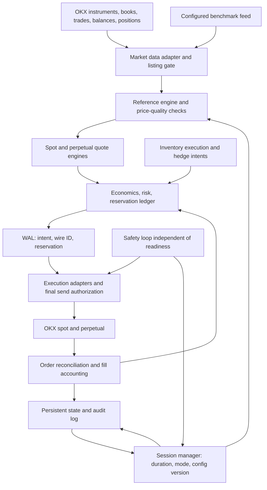

# LIFE–USDT on OKX: TDD Implementation Plan

Created: 2026-10-01 (Asia/Ho_Chi_Minh)

Source revision reviewed: `9af100d68`

Status: **implementation plan; no new trading code has been implemented or run live**.

Architecture and economics reviewed on 2026-10-01. All review findings are incorporated into this plan and mapped to implementation checklists and acceptance cases in Section 2.1. The controls below are **implementation and testing requirements**, not protections already available in the bot. All implementation checklists remain open.

## 1. Objectives and Scope

Build a market-making system for LIFE–USDT on OKX that can be tested before LIFE is listed. Support spot and linear perpetual swaps when OKX opens each market for trading. Session duration is configurable; four hours is only an example.

| ID | Capability | Expected outcome |
|---|---|---|
| R01 | Spot market making | Place genuine buy/sell orders and manage spread, depth, and LIFE/USDT inventory |
| R02 | Perpetual market making | Manage positions, margin, funding, and exposure for linear SWAP contracts |
| R03 | External market references | Configure BTC, ETH, or another pair with a supported data source; normalize units and validate benchmark suitability |
| R04 | Time-limited sessions | Accept `30m`, `2h`, `4h`, `12h`, etc.; keep session duration separate from the signal lookback window |
| R05 | Mode transitions | On expiry, stop quoting or transition to a qualified LIFE market reference |
| R06 | Inventory execution | Buy/sell a specified quantity within capital, execution, and market-impact limits |
| R07 | Spot/perpetual hedging | Adjust hedges using actual holdings and shared risk limits |
| R08 | Protection under adverse conditions | Limit stale quotes, concentrated fills, faulty data, and unresolved orders |
| R09 | Recovery and auditability | Preserve session deadlines, order identity, and partially filled exposure across restarts |
| R10 | Testing before listing | Simulate LIFE and test connector behavior with suitable fixtures/demo instruments |
| R11 | Economic viability | Check expected edge after costs before orders; distinguish profit-seeking MM from budgeted liquidity provision |
| R12 | Capital protection | Measure capital drawdown, exit costs, margin risk, and cumulative losses alongside net inventory |

**Scope limits:** no deliberate price pushing, matched trades to manufacture volume, deceptive orders, or enforcement of a predetermined chart. Inventory sales must reduce actual holdings within impact limits. A target such as “make LIFE fall X%” is not an acceptance criterion.

A benchmark is an input to the quoting model. It does not imply that LIFE will follow the source token's price. Historical price-path experiments belong in simulation. Live benchmark use requires a qualified LIFE valuation, model-divergence checks, and risk limits. Membership in the same ecosystem does not establish correlation.

## 2. Existing Components and Gaps

| Reviewed component | Reusable capabilities | Required work or limitation |
|---|---|---|
| [OKX spot connector](../../hummingbot/connector/exchange/okx/okx_exchange.py) | Order book, limit/maker orders, balances, tick/lot sizes | Add listing-phase checks; the current instrument filter does not check `state` |
| [OKX perpetual connector](../../hummingbot/connector/derivative/okx_perpetual/okx_perpetual_derivative.py) | Positions, contract sizes, modes, maker orders | Currently selects live linear SWAPs; dated futures and inverse contracts are outside this scope |
| [V2 controller base](../../hummingbot/strategy_v2/controllers/controller_base.py) | Configuration, market data, executor actions | Add coordination across both markets and shared limits |
| [V2 runner base](../../hummingbot/strategy/strategy_v2_base.py) | Multiple connectors/controllers within one bot | Test perpetual connector bootstrap and independent market shutdown |
| [Order executor](../../hummingbot/strategy_v2/executors/order_executor/order_executor.py) | Order tracking, retries, remaining exposure | Prove cancel/replace, idempotency, reservations, and authorization on every send |
| [TWAP configuration](../../hummingbot/strategy_v2/executors/twap_executor/data_types.py) | Execution over time | Defaults to TAKER; MAKER mode uses LIMIT and does not itself guarantee post-only behavior; do not reuse these defaults for LIFE |
| [Hedge controller](../../controllers/generic/hedge_asset.py) | Example hedge-ratio calculation | `update_markets` hard-codes the spot pair `asset-USDC`; adapt it for LIFE–USDT and configure leverage explicitly |
| [External price delegate](../../hummingbot/strategy/order_book_asset_price_delegate.pyx) | Prices from another pair | Returns the raw absolute price; does not convert a BTC price into a LIFE valuation |
| [Custom API feed](../../hummingbot/data_feed/custom_api_data_feed.py) | API price ingestion | Initializes price to zero and retains cached prices on fetch failure; add timestamps and quality checks |
| [Dynamic PMM](../../controllers/market_making/pmm_dynamic.py) | Example volatility-based spread adjustment | Requires candle history, which may be unavailable at listing |
| [Kill switch](../../hummingbot/core/utils/kill_switch.py) | Stop on a PnL threshold | Its current loop is approximately ten seconds; checks before individual orders are still required |

Mandatory integration work identified by the review:

- `ControllerBase.control_task()` depends on `MarketDataProvider.ready`, which combines readiness across connectors and candle feeds. Loss of readiness can prevent the controller from requesting cancellations. Use an independent safety loop and readiness per market.
- `OrderExecutor` can resubmit after cancellation/failure. Controller approval does not cover every send. Enforce a final authorization check for submissions and retries, including after waiting for the throttler.
- `_update_trading_fees()` is currently `pass` in both OKX connectors. Repository fee defaults are not verified account fee rates.
- The perpetual connector hard-codes `tdMode=cross`/`mgnMode=cross`; ONEWAY close orders do not currently send `reduceOnly`. `get_position_amount()` derives quantity from `notionalUsd / avgPx` and rounds it. Validate against contract counts and metadata before using that quantity for shared risk limits.
- The [V2 performance report](../../hummingbot/strategy_v2/executors/executor_orchestrator.py) divides `global_pnl_pct` by turnover. Capital drawdown requires a separate calculation.

These findings come from source inspection. They do not establish successful operation against OKX or LIFE.

### 2.1. Review-to-Implementation Traceability

Each review finding below is addressed in this specification. Implementation and verification remain pending; editing the plan does not close a delivery checklist.

| Review finding | Required control | Implementation checklist | Acceptance cases |
|---|---|---|---|
| 1. Missing net-edge gate | Account fees, costs by side/size, objective-specific economics and exit policy | P2.10, P4.11–P4.12 | A21–A22 |
| 2. Retries bypass controller approval | Revalidate permits immediately before every send | P4.13 | A23 |
| 3. Feed readiness blocks safety actions | Independent safety scheduling, cancellation priority, watchdog | P2.9, P4.15, P8.5 | A24, A36 |
| 4. Slow or net-flat losses evade caps | Markouts, cumulative loss budgets, hysteresis, bounded recovery | P4.9, P4.18, P5.10 | A27–A28 |
| 5. Weak or self-referential pricing | Reference-quality checks, divergence limits, own-order depth subtraction, separate benchmark validation | P3.11–P3.13, P5.13, P9.12, P6.14 | A25–A26 |
| 6. Incomplete capital/margin accounting | NAV and cashflow accounting, conservative exit value, joint stress | P4.7, P4.16–P4.17, P6.13 | A29–A30, A33 |
| 7. Perpetual connector assumptions | Position conversion and exchange-enforced close semantics | P0.7, P6.2–P6.3 | A31–A32 |
| 8. Missing economic release criteria | Separate evaluation data, objective-specific gates, staged capital deployment | P0.6–P0.8, P9.10–P9.13 | A38 |
| 9. Hedge churn and residual carry | Hedge batching within exposure deadlines; dynamic funding monitoring | P6.10–P6.12 | A34 |
| 10. Persistence introduced too late | Write-ahead order identity/reservations and one authorized sender | P4.14, P5.12, P8.3 | A35, A39 |
| 11. Overreliance on participation/STP/timers | Independent size/impact/loss limits and outage stress | P7.3, P4.15–P4.16, P8.5–P8.6 | A30, A36–A37 |

## 3. Proposed Architecture

Use **one V2 runner with one coordinating controller** for the MVP. It manages the enabled `okx` and `okx_perpetual` markets. The spot and perpetual quote engines have separate state and share an economics/risk engine, reservation ledger, and session store. Spot can run independently when perpetual trading is disabled or unavailable under the configured hedge policy.

The shared coordinator prevents separate engines from allocating the same capital or submitting orders that conflict with hedge targets. A future deployment across processes would require shared reservations and enforceable ownership of order submission; that extension is outside the MVP.

Safety, session deadlines, and reconciliation run independently of market-data readiness and the quote-creation queue. Feed failures revoke permission to increase risk while cancellation and reconciliation remain active. A single submission path revalidates permission after queues/throttling; executor retries must use that path. Watchdogs and exchange cancellation timers support process-failure handling. Outstanding quotes must remain within the capital budget for the configured outage scenarios.



### Module Boundaries

The paths below are **proposed** and do not yet exist:

| Path | Responsibility |
|---|---|
| `controllers/generic/life_liquidity.py` | CLI-discoverable entry point/configuration class, intent generation, and status reporting |
| `hummingbot/strategy_v2/life_liquidity/config.py` | Schema, units, validation, migration, and hot-reload policy |
| `hummingbot/strategy_v2/life_liquidity/market_data.py` | Timestamped snapshots, data quality, and listing status |
| `hummingbot/strategy_v2/life_liquidity/reference.py` | Qualified LIFE valuation, benchmark signals, confidence, and rejection reasons |
| `hummingbot/strategy_v2/life_liquidity/session.py` | State machine, deadlines, transitions, and resume behavior |
| `hummingbot/strategy_v2/life_liquidity/risk.py` | Limits, reservations, and allow/reduce/block decisions |
| `hummingbot/strategy_v2/life_liquidity/economics.py` | Actual fees, expected net edge, liquidity budgets, and PnL attribution |
| `hummingbot/strategy_v2/life_liquidity/safety.py` | Independent safety loop, expiring send permissions, watchdog, and cancellation priority |
| `hummingbot/strategy_v2/life_liquidity/quotes.py` | Pure quote-intent calculation; no direct API submission |
| `hummingbot/strategy_v2/life_liquidity/execution.py` | Executor coordination, inventory execution, and hedging |
| `hummingbot/strategy_v2/life_liquidity/state.py` | Sessions, intents, reservations, and reconciliation checkpoints |
| `hummingbot/strategy_v2/life_liquidity/telemetry.py` | Metrics, decision audit, and alerts |
| `scripts/life_liquidity_runner.py` | Dedicated runner if the generic loader cannot meet connector bootstrap/shutdown requirements; a distinct name avoids CLI confusion with the controller |

Reuse existing executors and storage where their behavior satisfies the contracts. Changes to shared code require regression tests demonstrating the need. Each new adapter needs contract tests against the repository's actual executor implementation.

### Data Contracts

- `MarketSnapshot`: instrument, exchange timestamp, monotonic receive time, bid/ask, depth, market state, and data source.
- `ReferenceDecision`: price in USDT per LIFE or `unavailable`, source/model version, confidence, age, and reason code. Zero is not a fallback price.
- `OrderIntent`: market, side, base quantity, limit price, purpose (`quote/inventory/hedge`), session/config version, and stable ID.
- `RiskDecision`: allow/reduce/block, permitted quantity, reservation ID, and reason code.
- `ExecutionEvent`: client/exchange order IDs, cumulative fill, deduplicated incremental fill, fees, cancellation state, and remaining exposure.
- `FeeSnapshot`: account/instrument, maker/taker rates with normalized signs, currency, timestamp, schema/version, and confidence.
- `EconomicDecision`: expected net edge by side/size, hedge/holding assumptions, uncertainty, cost breakdown, remaining budget, and reason code.
- `AccountRiskSnapshot`: capital and cashflows, NAV/high-water mark, shared assets, positions, margin, conservative exit value, and data-quality flags.
- `SendPermit`: intent/wire client order ID, reservation, session/config/risk epoch, expiry, and quantized price/quantity. Validate it on every send; reconcile ambiguous request outcomes before retrying.

## 4. Configuration and Time Rules

The names below describe the intended schema. P1 will implement it and produce validated examples. This table is not a runnable configuration.

| Field | Rule |
|---|---|
| `execution_mode` | `simulation`, `shadow`, `demo`, or `live`; default to `simulation` |
| `spot.enabled`, `perpetual.enabled` | Enable independently; block perpetual trading if the instrument does not exist |
| `session.duration` | Required for a timed session; accept `s/m/h/d`; finite and positive; `4h` is only an example |
| `session.start_policy` | `when_ready` or an explicit UTC time; `when_ready` starts only after the required data and listing gates pass |
| `session.on_expiry` | `pause_quotes` or `switch_to_market_reference`; default to `pause_quotes` |
| `session.successor_duration` | Required for switching; finite duration for the successor market-reference session, measured from the original deadline; no automatic infinite chain |
| `reference.mode` | `market`, `bounded_benchmark`, or `bootstrap_simulation`; bootstrap is simulation-only |
| `reference.sources[]` | Connector/feed, pair, quote currency, and weights; at most one optional benchmark in the MVP; baskets require separate validation |
| `reference.lookback` | Signal data window, independent of `session.duration` |
| `reference.influence` | Bounded benchmark influence; not a profit or chart-movement target |
| `reference.max_age`, `reference.max_deviation_bps` | Reject stale sources and divergence beyond validated model limits |
| `reference.transition_duration` | Transition time when both sources remain valid; smoothing must not prolong use of a failed source |
| `quotes.spreads_bps`, `quotes.sizes_base` | Explicit units and matching level counts; quantities remain within balances and limits |
| `risk.*` | Inventory, gross/net exposure, rolling fills, capital drawdown, margin, reference quality, and latency |
| `economics.objective` | Explicitly choose `profit_mm` or `liquidity_service`; never switch automatically to excuse losses |
| `economics.min_net_edge_bps`, `economics.uncertainty_buffer_bps` | Apply after rounding and costs; calibrate from evidence; no invented live defaults |
| `economics.subsidy_budget_quote` | Session/day/campaign budgets for `liquidity_service`; negative expected edge is allowed only within its assigned budget |
| `economics.fee_max_age`, `economics.holding_horizon` | Fee TTL and position-holding assumption; session duration does not determine position lifetime |
| `risk.markout_horizons`, `risk.markout_min_samples` | Configurable horizons and sample requirements, separated by side/size; missing samples do not prove safety |
| `risk.stress_loss_budget_quote`, `risk.execution_loss_budget_quote` | Separate stress and execution-loss budgets, distinct from price changes in starting inventory |
| `risk.resume_policy` | Hysteresis, stable-data period, small recovery quotes, and authority to clear HALT; no budget reset |
| `hedge.deadband_base`, `hedge.max_unhedged_base`, `hedge.max_unhedged_duration` | Batch within limits; exposure/time caps take priority over fee savings |
| `hedge.max_slippage_bps`, `hedge.basis_limit_bps`, `hedge.funding_budget_quote` | Evaluate executable quantity and residual positions; breaches block additional risk |
| `inventory.target_base`, `inventory.deadline` | Target holdings and execution deadline; no target for depressing market price |
| `inventory.price_limit`, `inventory.max_participation` | Execution constraints; do not relax them automatically to complete quantity |
| `perpetual.leverage`, `perpetual.position_mode`, `perpetual.margin_mode` | Explicit live values; do not inherit example leverage of 20; reject modes not verified by the adapter |

Use `Decimal` for prices and quantities. Keep basis points, percentages, and fractions distinct; `100 bps = 1% = 0.01` is a mandatory test. Strategy configuration must use the existing credential storage mechanism rather than embed API keys.

Persist start/expiry timestamps in UTC. Measure in-process intervals/timeouts with a monotonic clock. On restart, validate the wall clock before allowing new orders. Downtime counts toward session duration. Restart, reconnect, and hot reload do not reset anchors or implicitly start a new session.

Apply hot reload as one validated configuration version. Recalculate a changed duration from the original `started_at`; shortening it past the current time triggers expiry handling. Hot reload cannot revive a completed session. Benchmark changes require an explicit transition/version; the MVP permits them only while paused. Perpetual account/position modes may change only when no conflicting orders or positions remain.

**P3 offline benchmark research model (not a live valuation approval).** Freeze an independently qualified LIFE/USDT anchor `L0` and each source's USDT anchor `Si0` in the durable session journal. For a source quoted in currency `Qi`, first convert its current price to USDT using a qualified contemporaneous `Qi/USDT` rate, then calculate its dimensionless return `Ri = Si(now, USDT) / Si0`. A research basket gives `B = L0 × Σ(wi × Ri)` with positive weights summing exactly to one. The tentative LIFE reference is `C = (1 − α) × M + α × B`, where `M` is the current independent two-sided LIFE/USDT book midpoint and `α` is bounded by an explicitly supplied research policy. The configured MVP uses one source with weight one; basket arithmetic is tested only as an extension. An absolute BTC, ETH, or AVAX price never becomes a LIFE price. Missing conversion or a changed anchor makes this model unavailable. Failed source liquidity or correlation evidence removes its influence and may use qualified `M`; excessive deviation from `M` blocks the candidate. No trade, fill, or candle is synthesized. A hypothetical `L0` is labeled simulation-only. Market depth must exclude the bot's own orders; if separation is unknown, `M` is unqualified. Correlation evidence must predate the decision and be fresh. Synthetic test thresholds are not live defaults. Before any live benchmark use, the market-data owner must supply qualified LIFE history, freeze the model and thresholds on a calibration set, then compare against a market-only baseline on a disjoint time-ordered evaluation set. Missing or unrepresentative LIFE evidence yields insufficient evidence.

Expiry always revokes the old session/epoch's send permissions. `pause_quotes` leaves it `EXPIRED`. `switch_to_market_reference` may create one successor session/epoch under the configured policy: persist the transition with a stable identity, cancel/reconcile old orders, and recheck reference/risk/economics before new quotes. The successor starts at the original `expires_at` and ends after `successor_duration`; downtime does not extend this window. Restart must not duplicate the successor, revive an old epoch, or reset daily/campaign budgets. An expired successor or unqualified LIFE reference cannot quote.

### 4.1. Economic Contract Before Every Order

1. **Objective:** `profit_mm` requires conservative expected edge after costs to meet its threshold. `liquidity_service` has explicit spread/depth/uptime KPIs and a cost budget; report that spending as liquidity-service expense. Neither mode assumes guaranteed profit.
2. **Calculate by side and size:** measure the proposed quote against a qualified LIFE valuation or executable hedge/exit price. Deduct maker fees, hedge/exit fees, impact, carry/funding, inventory risk, and model uncertainty as applicable. Do not assume both sides will fill. If executable VWAP already includes impact, do not charge the same impact twice. Do not duplicate adverse-selection adjustments already included in the forecast.
3. **Authorize the final order:** recalculate after tick/lot rounding, size changes, and immediately before submission. If the objective's gate fails, block, reduce size, or widen within policy. Quotes outside liquidity KPIs must be reported as unmet service. Subsidy mode reserves expected spending and reconciles actual costs while retaining every hard risk limit.
4. **Risk reduction:** inventory exits and urgent hedges have a separate price/slippage/exit-loss policy so the profit gate cannot trap inventory. They must not silently remove limits or reverse a position under a risk-reduction label.
5. **Fees and carry:** use account/instrument fees with a TTL. Missing fees require an explicitly approved conservative fee ceiling or a pause. Reconcile actual fill fees/rebates by currency. Funding uses the current settlement schedule and includes positions remaining after session expiry.

The cost model must define units and signs. For a single candidate fill, a testable form is `net_edge_per_base = side_sign × (qualified_exit_or_value_price − quote_price) − applicable_costs_per_base`, with `side_sign=+1` for a buy and `−1` for a sell. Convert using `net_edge_quote = net_edge_per_base × base_quantity` and `net_edge_bps = 10000 × net_edge_quote / reference_notional_quote`, with a documented positive reference notional. The valuation/exit assumption and cost components must match the execution policy. A model valuation is not a guaranteed executable exit. Normalize charges as positive costs and confirmed rebates as negative costs; uncertain rebates cannot be assumed earned.

Illustrative arithmetic fixture, **not an OKX fee schedule**: a buy/sell round trip earning gross edge of 0.12 USDT with total costs of 0.18 USDT loses 0.06 USDT. `profit_mm` must reject that expected outcome; more turnover would increase losses. This round-trip fixture does not permit the production gate to assume both sides fill.

OKX distinguishes fees/rebates by sign and documents the `feeGroup` schema; verify instrument applicability and the current schema during implementation. Funding may settle every 1/2/4/8 hours and the schedule can change. [Fee API](https://www.okx.com/docs-v5/en/#trading-account-rest-api-get-fee-rates), [funding FAQ](https://www.okx.com/en-us/help/funding-fees-for-perpetual-contracts-faq), [funding interval changes](https://www.okx.com/en-au/help/okx-to-enable-automatic-updates-for-funding-fee-settlement-period).

### 4.2. Economic Risk Measurement and Adverse-Flow Response

- **Three distinct measurements:** capital equity/drawdown adjusted for deposits/withdrawals; execution performance and MM costs; conservative exit value from executable depth. Accounting and performance measurements use qualified independently observed LIFE prices or conservative executable exit valuations. Benchmark-adjusted quote-model forecasts are tracked separately and cannot establish their own economic success. Missing observations remain unavailable and invoke the conservative risk policy. Do not use `PnL / turnover` for capital drawdown or near-zero issuer acquisition cost to claim profitable MM. A LIFE rally can conceal repeated sales at unfavorable prices.
- **Markouts:** for `s=+1` on buys and `s=−1` on sells, measure `s × (observed_LIFE_reference_at_fill_plus_horizon − fill_price) × filled_base`. A negative value indicates an adverse fill relative to the later independent observation. Use qualified observed prices and separate horizons/sides/sizes. Multiple horizons for the same fill are not additive realized losses. Markout is diagnostic and must not be added again to mark-to-market PnL. Unavailable future observations remain unavailable, and may only enter decisions after their observation time.
- **Fast and slow responses:** stale feeds or large divergence trigger immediate block/cancel actions; delayed markout statistics add evidence. `NORMAL → DEGRADED → PAUSED` uses hysteresis, cumulative loss limits, and small recovery quotes. Clearing a hard HALT requires separate authority. New sessions/restarts do not reset active daily/campaign budgets or unresolved reconciliation state.
- **Qualified valuation:** freshness alone is insufficient. Exclude known own quotes where feasible; otherwise reduce confidence. A tiny trade or transient depth level must not automatically re-anchor valuation. Displayed liquidity may disappear before a hedge executes; use conservative depth haircuts/stress and independent sources where available. An unqualified listing-time reference requires a pause.
- **Stress before orders:** model all same-side levels filling during delayed cancellation, hedge outages, disappearing depth, LIFE/benchmark divergence, basis/funding/mark shocks, and maintenance-margin tier changes. Zero net delta can still leave insufficient collateral. Bound quantity and reservations by capital available for the selected scenarios; the stress budget is not a guarantee against every price gap.
- **Observation limits:** the counterparty's identity is generally unavailable and unnecessary for these controls. Public volume does not establish independent demand. Participation limits must be combined with hard quantity, notional, slippage, and loss budgets.

Measure margin separately using exchange data. Mark price and maintenance margin affect liquidation risk. [OKX liquidation FAQ](https://www.okx.com/en-us/help/liquidation-faq).

## 5. TDD Workflow and Shared Definition of Done

Implement each behavior in a small cycle:

1. **Red:** write a Given/When/Then test, run it in isolation, and retain the failure demonstrating the missing behavior. Import failures or an incomplete environment do not count as a valid Red result.
2. **Green:** implement the minimum code needed to pass; do not add unrequested strategy branches.
3. **Refactor:** separate pure calculations from I/O, keep tests green, and preserve behavior outside the change.
4. **Regression:** run tests around the changed code and any affected contracts.
5. **Evidence:** record the command, commit, result, test ID, and remaining limitations in the progress table.

Unit tests use a fake clock, `Decimal`, fixed snapshots, and fixed seeds; they must not sleep, access the network, or require API keys. Integration tests use connector/executor fakes that preserve real event contracts, with REST/WS stubs where needed. Default test runs must never start demo or live trading.

[CONTRIBUTING.md](../../CONTRIBUTING.md) requires at least 80% unit coverage for changes. Apply a >=80% diff-coverage gate to changed code and require passing tests for every mandatory risk scenario in this plan; coverage does not replace behavioral verification.

A phase may be marked complete only when:

- [ ] New behaviors have documented Red → Green evidence.
- [ ] Relevant acceptance and regression tests pass; difficult tests are not skipped to satisfy a gate.
- [ ] Deliverables exist and can be read or validated.
- [ ] No real orders are generated outside explicitly enabled trading tests.
- [ ] Configuration, units, reason codes, and behavior changes are documented.
- [ ] A reviewer can reproduce results using the recorded commands; known failures have classified causes.

For a requirement that spans pure logic and the running bot, track those scopes as separate nested checkboxes. An `[x]` on an offline or connector-contract subtask means only that named behavior has been implemented and tested. The parent requirement stays `[ ]` until every subtask passes; the phase stays in progress until all parent requirements and the phase definition of done pass. Synthetic fixtures never count as live calibration or exchange evidence.

## 6. Roadmap and Status

Foundation: `P0 → P1 → P2 → P3 → P4 → P5`. Minimum persistence, the safety loop, and audit records are required in P4/P5; P8 adds hardening and system tests.

Release in stages that allow separate economic validation:

1. **Spot MVP:** spot MM using a qualified LIFE market reference, P0–P5, and the spot portions of P8/P9. A single explicitly selected bounded benchmark is optional and requires separate supporting evidence. Without sufficient LIFE data, remain in simulation/shadow.
2. **Perpetual hedging:** add P6 after connector contract tests and funding, margin, and hedge economics pass their gates; an appropriate OKX contract must actually exist.
3. **MM on both markets:** enable perpetual quotes only after separate evaluation; successful hedging does not establish that perpetual MM is viable.
4. **Inventory execution/baskets:** P7 and benchmark baskets are extensions justified by validated needs. Stop/cancel/reconciliation behavior and residual-inventory policies remain mandatory from the MVP.

Each stage must pass its applicable P8/P9 gates before live operation. Completing the spot stage does not complete the full R01–R12 scope.

| Phase | Main deliverable | Status | Evidence/commit |
|---|---|---|---|
| P0 | Behavioral specification, baseline, and test harness | Complete for offline scope | P0 evidence below |
| P1 | Schema, units, and configuration validation | Complete for offline/CLI scope; trading remains disabled | P1 evidence below |
| P2 | Market data and listing gate | Complete for offline scope; live gates remain P9 | P2 verification below |
| P3 | Reference engine and configurable sessions | Complete for offline scope; real order and market evidence gates remain P4/P5/P9 | P3 verification below |
| P4 | Economics, risk, reservations, safety loop, and minimum WAL | In progress; offline components, protected send contract, safety callback, and configured watchdog verified; cancellation priority and order-capable integration open | P4 checklist and progress below |
| P5 | Spot MM and order lifecycle | In progress; P5.1 offline planning and opt-in action proposals, P5.3 durable slot claims/protected sender binding, P5.4 atomic fill-snapshot accounting, P5.6 host-local dispatch claims, cold-start provenance checks, and request-budget contract, and P5.7 spot recovery contracts verified; production quote issuance open | P5 checklist and progress below |
| P6 | Perpetuals, hedging, and shared risk | Not started | — |
| P7 | Inventory execution and mode transitions | Not started | — |
| P8 | Recovery, telemetry, and system tests | Not started | — |
| P9 | Demo, runbook, and release gates | Not started | — |

### P0 — Define behavioral contracts and establish the baseline

**Goal:** define the implementation scope and create LIFE fixtures that do not depend on an actual listing.

**Red first:** tests prove that the fake exchange cannot generate fills merely because the bot places/cancels quotes; the fake clock controls deadlines; duplicate fill callbacks cannot credit assets twice.

**Implementation:** create the harness under `test/hummingbot/strategy_v2/life_liquidity/`, reusable fixtures, a balance ledger, and a fake exchange. Record baseline results for relevant connector/executor suites before changing code.

- [x] P0.1: Map R01–R12 to test IDs, modules, and completion phases.
- [x] P0.2: Define `CREATED`, `WAITING_READY`, `ACTIVE`, `TRANSITIONING`, `PAUSED`, `EXPIRED`, `HALTED`, and `RECONCILING`, including order permissions in each state.
- [x] P0.3: Provide fixtures for an empty book, no trades, a one-sided book, partial fills, pending cancellation, and restart.
- [x] P0.4: Verify the Conda/Cython/pytest environment; record baseline passes/failures and distinguish environment failures from strategy defects.
- [x] P0.5: Document unknowns: listing phases, a valid LIFE reference price, budgets, risk thresholds, account mode, actual fees, and OKX market-maker obligations.
- [x] P0.6: Select `profit_mm` or `liquidity_service`; define starting-capital/cash-flow accounting, subsidy/execution-loss/stress budgets, and liquidity KPIs. Specify units, owners, and calibration methods. Label synthetic test values explicitly and track unresolved live values in the decision register. Every live threshold needs a numeric value and supporting rationale before P9 live eligibility; unresolved live inputs do not block offline implementation and cannot become implicit live defaults. The technical measurement contract and live `liquidity_service` objective are recorded below; numeric owner approvals remain P9 release gates.
- [x] P0.7: Audit actual connectors for account fees, position quantity, margin/position modes, exchange-enforced closing semantics, and the final send path. Track spot and perpetual blockers separately; a working demo does not clear accounting blockers.
- [x] P0.8: Define calibration/evaluation dataset requirements and separation, a no-trading baseline, and an MM baseline using only a qualified LIFE reference. Track unavailable LIFE datasets as unresolved evidence; synthetic fixtures permit offline development but do not satisfy live economic validation. Freeze numeric acceptance thresholds before evaluation. Do not use future data to make current pricing decisions.

**Done when:** fixtures produce repeatable offline results, and unresolved assumptions are not silently replaced with live defaults.

#### P0 implementation evidence and remaining decisions (2026-10-01)

The offline harness is in [fakes.py](../../test/hummingbot/strategy_v2/life_liquidity/fakes.py) with behavior tests in [test_fakes.py](../../test/hummingbot/strategy_v2/life_liquidity/test_fakes.py). It uses `Decimal`, a manual UTC/monotonic clock, explicit fill injection, fill ID deduplication, pending cancel states, and JSON-compatible checkpoints. Empty and one-sided books never manufacture trades. Exchange-level balance changes occur only on injected fills; order reservations, fees, and connector event contracts belong to later phases.

| Evidence | Command / result |
|---|---|
| Red | `python3 -m unittest -v test.hummingbot.strategy_v2.life_liquidity.test_fakes`: 8 behavior tests failed at deliberate `NotImplementedError` stubs; imports and test environment worked. |
| Green | `python3 -m unittest -q test.hummingbot.strategy_v2.life_liquidity.test_fakes`: 9 tests passed, including a JSON checkpoint and fill/cancel ACK race. |
| Repository baseline | Initial `python3 -m unittest -q` against `test_terminal_exposure`, OKX spot, and OKX perpetual modules stopped at import due to missing `pandas` or `aioresponses`; source revision `34432aadf`. After installing the full source environment, `pytest -q` on those same three modules passed **110 tests**. |
| Runtime scope | No exchange connector, credential, network call, or order sender is imported by the new harness. |

**P0.1 traceability.** The table points to planned tests and implementation modules; the only implemented tests here are the offline harness cases above.

| Requirement | Acceptance IDs | Planned module / completion phase |
|---|---|---|
| R01 | A04, A07–A08, A21 | `quotes.py`, `execution.py`; P4–P5 |
| R02 | A16, A31–A34 | perpetual adapter, `risk.py`; P6 |
| R03 | A05, A17, A25–A26 | `reference.py`; P3/P5/P9 |
| R04 | A02–A03 | `config.py`, `session.py`; P1/P3 |
| R05 | A03, A11, A23 | `session.py`, `safety.py`; P3–P5 |
| R06 | A12, A37 | `execution.py`; P7 |
| R07 | A10, A34 | `execution.py`, `risk.py`; P6 |
| R08 | A06–A08, A23–A24, A27, A30 | `market_data.py`, `risk.py`, `safety.py`; P2–P5 |
| R09 | A03, A09, A13, A35 | `state.py`, `execution.py`; P4/P5/P8 |
| R10 | A01, A19–A20 | `market_data.py`, `config.py`; P0–P2 |
| R11 | A21–A22, A38 | `economics.py`; P2/P4/P9 |
| R12 | A29–A30, A33 | `risk.py`, `economics.py`; P4/P6 |

**P0.2 session permissions.** These are design contracts for P3/P4 tests, not implemented state transitions.

| State | New risk-increasing orders | Required safety behavior |
|---|---|---|
| `CREATED` | No | Load persisted state and reconcile before readiness checks |
| `WAITING_READY` | No | Continue listing/data checks; reconcile any pre-existing orders |
| `ACTIVE` | Only with current reference, economics, risk, and final-send permit | Monitor fills, deadlines, and feed quality |
| `TRANSITIONING` | No orders under the old epoch | Revoke old permits, cancel/reconcile, persist successor before its first quote |
| `PAUSED` | No new quotes | Cancel and reconcile; exposure reduction requires its own policy and limits |
| `EXPIRED` | No orders under the expired epoch | Reconcile; at most one valid successor may activate under P3.9 |
| `HALTED` | No new risk; no automatic resume | Cancel/reconcile; separately authorized exposure reduction retains price limits |
| `RECONCILING` | No | Query unresolved orders/positions and retain reservations until confirmed |

**P0.6 measurement contract.** This is the specification for P4 accounting and P9 release evidence; it is not an implemented ledger or a live approval.

- **Capital basis:** record the capital allocated to this strategy, its opening balances, and independently qualified, conservative LIFE exit value in USDT at the campaign anchor. A shared account needs a strategy subledger reconciled to the exchange account, so unrelated assets and trades do not enter strategy NAV. Maintain an immutable, timestamped external deposit/withdrawal ledger; value non-USDT flows at a qualified conversion rate when they occur. `NAV_USDT` is net allocated equity including spot assets, perpetual positions, liabilities, fees, and funding exactly once. The adapter must document which components its equity snapshot already includes and convert OKX's USD-denominated account fields to USDT explicitly; `totalEq`, `adjEq`, and available equity have different meanings in the [OKX account balance API](https://www.okx.com/docs-v5/en/#trading-account-rest-api-get-balance). Calculate `adjusted_NAV_USDT = NAV_USDT − cumulative_external_net_inflows_USDT`; drawdown is `max(0, adjusted_high_water_mark_USDT − adjusted_NAV_USDT)` and its percentage uses the positive adjusted high-water mark. A deposit cannot erase a loss. If LIFE cannot be valued independently, report NAV/drawdown as unavailable and block additional risk rather than using the bot's own target quote as a mark.
- **Performance attribution:** report (a) market-price contribution on inventory actually held over each observation interval, with opening inventory shown separately, (b) execution contribution from fills relative to the qualified contemporaneous valuation or executable exit, and (c) actual fees, funding, hedging, and exit costs. Reconcile their sum with cashflow-adjusted NAV change; never count markouts at multiple horizons as additional realized PnL. Track gross and net spot/perpetual exposure together, while keeping product-level attribution.
- **Budget units and use:** all monetary budgets, reservations, consumption, and NAV use USDT; quote width uses bps, order depth uses LIFE and USDT, availability uses a fraction of eligible time. For `liquidity_service`, reserve the conservative expected negative net edge of all simultaneously fillable open quotes against session/day/campaign subsidy caps. Reconcile reservations to actual realized execution and costs after fills; unresolved orders retain reservations. Execution-loss, stress-loss, and risk-reduction exit-loss caps are distinct hard limits and cannot be replenished by a new session, restart, a favorable benchmark mark, or unused subsidy. The session/day/campaign identifiers and UTC boundaries are persisted. A simultaneous-fill and impaired-exit scenario must remain within the approved stress cap before each order.
- **Liquidity KPIs:** define two-sided quoting availability as time with both valid bid and ask divided by independently eligible continuous-trading time; also report availability over the full configured session so pauses cannot disappear from reports. Measure quoted spread in bps at a defined LIFE size and bid/ask executable depth in LIFE and USDT after minimum size, own-balance, and order-state checks. Report accepted/canceled order rates, response latency, and fill quality separately; displayed quote volume is not traded volume. The owner must set numeric targets, quote size, measurement window, minimum eligible sample, and exclusions before evaluation.
- **Calibration:** the market-data owner supplies qualified LIFE observations and depth; the account operator supplies fee/funding and cashflow evidence; the risk owner proposes loss/stress caps from adverse-fill, latency, liquidity-withdrawal, and margin scenarios; the project owner selects the objective, capital allocation, subsidy affordability, and liquidity target. Freeze values and rationale before the separate evaluation set. Missing or sparse observations cannot be treated as passing data. An offline fixture may use arbitrary labeled values to test arithmetic but cannot populate live configuration.

**P0.5–P0.6 decision register.** Offline fixtures use 100 LIFE and 1,000 USDT as **synthetic test balances**, not a funded live allocation. `profit_mm` is a provisional **offline test objective**. On 2026-10-01 the requester chose `liquidity_service` as the **intended live objective for implementation**; project-owner sign-off remains a P9 release decision. P0.6 is complete as an offline specification. Funded starting capital, monetary limits, and measurable service targets remain open P9 release decisions. A numeric live limit needs a recorded rationale and evidence before P9; an unresolved value has no implicit default.

| P0.6 live decision | Unit / owner | Calibration evidence and acceptance record | Current value |
|---|---|---|---|
| Objective | `profit_mm` or `liquidity_service` / project owner | Requester choice recorded in this conversation, 2026-10-01; project-owner release sign-off pending | `liquidity_service` for implementation |
| Funded starting balances | LIFE and USDT / project owner | Funding source, allocation, and account snapshot | **TBD** |
| Session/day/campaign subsidy caps | USDT per UTC window / project owner and risk owner | Affordable service expense under adverse fill and fee scenarios; required only for `liquidity_service` | **TBD** |
| Execution-loss and risk-reduction exit-loss caps | USDT per session/day/campaign / risk owner | Calibrated adverse markouts, executable exit depth, and allowed cash loss | **TBD** |
| Joint stress-loss and capital drawdown caps | USDT and drawdown % / risk owner | All-open-orders fill, delayed cancel, impaired exit, basis/margin shocks, and funded capital tolerance | **TBD** |
| Two-sided availability, spread, and depth targets | % of eligible/full session, bps, LIFE and USDT at specified size / project owner and market-data owner | Continuous-market samples, documented windows/exclusions, minimum sample size | **TBD** |
| Fee, funding, and valuation assumptions | USDT, bps, TTL, source timestamps / account operator and market-data owner | Account-specific exchange snapshot and qualified independent LIFE observations | **TBD** |
| Book snapshot maximum age | milliseconds / market-data and risk owners | Observed OKX book update cadence, REST latency, and adverse-fill tolerance; the 2,000 ms P2.4 fixture is synthetic only | **TBD** |
| Book feed maximum silence | seconds / market-data and risk owners | Observe OKX WebSocket heartbeat cadence and network jitter; the 65-second P2.5 fixture is synthetic only | **TBD** |

| Open live input | Owner / evidence needed | Gate |
|---|---|---|
| Listing stage, actual spot/SWAP instruments and MM obligations | Operator/OKX account information and instrument metadata | P2/P9 |
| Qualified independent LIFE valuation and benchmark suitability | Market data owner; post-listing order book/trades and model evaluation | P3/P9 |
| Account fee tier, fee currency, funding schedule, position/margin modes | Account operator; exchange account/API snapshots | P2/P6/P9 |
| Starting capital, deposits/withdrawals, subsidy/exit/stress budgets and liquidity KPIs | Project owner and risk owner; quote-currency amounts and measurement window | P1/P4/P9 |
| Response latency, source age, markout horizons, resume policy | Risk owner; measured feed/order timing and calibrated loss tolerance | P1/P4/P9 |

**P0.7 connector audit.** These findings are blockers to their corresponding live features, not claims that the adapter has been fixed.

| Scope | Inspected behavior | Required before live |
|---|---|---|
| Spot | `OKXExchange._update_trading_fees()` is `pass`; trading rules parse size increments but require a listing-state gate. | P2 account-specific fee snapshot and continuous-trading validation |
| Perpetual | `_update_trading_fees()` is `pass`; `get_position_amount()` uses `notionalUsd / avgPx` and rounds, and `_place_order()` hard-codes cross margin without ONEWAY `reduceOnly`. | P2 fee snapshot; P6 position quantity, mode, and exchange-enforced close contract tests |
| Shared submission | `OrderExecutor.control_order()` can place an order when `_order` is absent, including after failure/cancel; controller approval alone is insufficient. | P4 final-send gate on every send/retry/renewal |
| Safety | `ControllerBase.control_task()` requires global provider readiness and an executor update event. | P2 callback scheduling and P4 independent safety-loop contract tests |

**P0.8 evaluation protocol.** Capture timestamped, independently observed LIFE order book/trade data; account fees/funding, order acknowledgments, fills, cancel latency, and cashflows. Keep calibration and evaluation periods disjoint and time ordered. Freeze numerical thresholds and model version before evaluation; do not tune on the evaluation period or use future observations to price current orders. Compare equal initial capital, inventory, horizon, and risk constraints against (1) holding the starting inventory with no trading and (2) spot MM using a qualified LIFE reference without a benchmark. The current fixtures are synthetic; no LIFE dataset or economic result has been certified for live use.

**P0 status:** complete for the offline behavioral specification and baseline. The fixtures are repeatable, the P0.6 measurement contract and objective are recorded, and the selected connector/executor baseline now passes. Unresolved listing data and numerical live decisions remain later-phase/P9 gates.

### P1 — Schema and validation

**Tests first:** `test_config.py`, `test_duration.py`, `test_config_update.py`.

- [x] P1.1: Parse `30m`, `4h`, and `12h` correctly; reject zero, negative, infinite, NaN, and malformed durations or units.
- [x] P1.2: Changing `lookback` does not change session duration, and vice versa.
- [x] P1.3: Prices/quantities use `Decimal`; bps/percent/fraction conversions have separate tests.
- [x] P1.4: Reject invalid benchmark weights, currencies without conversion paths, unknown fields, and missing live limits.
- [x] P1.5: An invalid configuration update preserves the previous configuration, records a reason code, and generates no orders. The real CLI rolls back invalid nested edits; the V2 loader reports failed YAML to the LIFE controller, which retains its active config, records `CONFIG_LOAD_FAILED`, and blocks queued `CreateExecutorAction` at the runner listener. Network send/retry validation remains P4.13.
- [x] P1.6: Provide `simulation.yml.example` and a JSON/schema export; examples contain no credentials and cannot automatically start live trading.
- [x] P1.7: The real `hbot create` CLI discovers `life_liquidity`, writes a validated nested controller config, and accepts a dotted nested setting. `hbot config` validates and rolls back invalid file edits. Nested strategy values are not live-updatable in P1 and take effect after restart; in-process V2 runner loading is tested.
- [x] P1.8: Reject live configurations missing an objective, fee policy, or cost/loss/stress budgets. Subsidies require an explicit allocation and cannot disable hard limits.
- [x] P1.9: Reject margin modes unsupported by the adapter; feature-gate benchmark baskets and perpetual quotes until each has separate evidence.

**Done when:** all validation cases pass and example files parse/round-trip without losing precision or changing units.

#### P1 implementation evidence and boundaries (2026-10-01)

The pure Pydantic schema in [config.py](../../hummingbot/strategy_v2/life_liquidity/config.py) validates explicit duration units, `Decimal` quote prices/sizes/spreads, source weights/currency, account mode restrictions, expiry successor duration, bounded subsidy windows, inventory/hedge limits, markout horizons, and economic/risk fields. Nested models reject unknown fields and use immutable tuples for quote levels. Hot reload constructs and validates one new config version; the old version is preserved on failure. Live mode remains disabled at this phase even if the currently defined numeric fields are supplied. The [simulation example](../examples/life_liquidity/simulation.yml.example) and [generated JSON Schema](../examples/life_liquidity/config.schema.json) are checked for round-trip and structural schema consistency.

| Evidence | Command / result |
|---|---|
| Red | Isolated `pytest` against the initial permissive config: 32 behavior failures and one pass; failures came from missing parsing/validation/update behavior. A later nested-mutation test failed on a mutable list before tuple conversion. |
| Green | `/tmp/life-p1-venv/bin/python -m pytest -q test/hummingbot/strategy_v2/life_liquidity`: 53 passed, including P0 harness tests, with Pydantic 2.13.5 and pytest 9.1.1 in a temporary environment. |
| Coverage | `COVERAGE_FILE=/tmp/life-p1-coverage /tmp/life-p1-venv/bin/python -m coverage run --rcfile=/dev/null --include='*/hummingbot/strategy_v2/life_liquidity/config.py' -m pytest -q test/hummingbot/strategy_v2/life_liquidity`, followed by `coverage report --rcfile=/dev/null -m` with the same `COVERAGE_FILE`: 89% line coverage of `config.py`. This is isolated module coverage, not the repository's CI diff-coverage gate. |
| Example/schema | YAML validates in simulation mode, survives JSON round-trip, and equals `StrategyConfig.model_json_schema()`; no API credentials or order sender is configured. |
| P1.7 isolated adapter | Red: 4 adapter tests errored while the module was absent. Green: `controllers/generic/life_liquidity.py` exposes one V2 config/controller pair. Isolated tests cover V2 class selection, nested YAML/JSON round-trip, nested validation failure, inert actions, rejected hot reload, and the synthetic `controller.simulation.yml.example`. |
| Full source environment | `make install` completed on macOS arm64 after replacing the removed `conda develop` step with a source `.pth` link. The source environment includes compiled extensions and the real CLI/controller/runner imports. |
| Real CLI and runner | `test_runtime_integration.py` uses the real `hbot create` and `hbot config` Typer commands, config loader/editor, `ControllerBase`, `StrategyV2ConfigBase.load_controller_configs()` and class discovery, `StrategyV2Base.update_controllers_configs()`, and `listen_to_executor_actions()`. Invalid nested CLI edits restore the YAML; invalid YAML in the runner preserves the controller config, records `CONFIG_LOAD_FAILED`, and drops an already queued create action. Script-owned create actions retain their existing path. |
| Green / regression | LIFE suite: **73 passed**. LIFE + V2 runner/controller + CLI config/create suites: **208 passed**. Selected OKX spot/perpetual and order executor baseline: **110 passed**. `flake8` on the changed LIFE Python files passed. The repository-wide suite and a daemon-process smoke test are not claimed. |

P1.5 uses `ConfigUpdateState`: rejected updates preserve the active config/version, record `CONFIG_VALIDATION_FAILED`, `CONFIG_UPDATE_UNSUPPORTED`, or `CONFIG_LOAD_FAILED`, and latch `order_permission()` false. The TDD red run had 3 failing new core tests before the state class, another failing test before the load-failure method, and adapter tests before controller hooks existed. The real V2 loader now reports malformed YAML through the LIFE fail-closed hook. The runner rechecks controller permission after dequeuing actions and drops blocked create actions. The LIFE controller remains inert until later strategy gates, and the final connector send/retry gate belongs to P4.13. P1.7 uses the real CLI for creation, nested dotted edits, validation, and rollback; the interactive client prompt traversal still does not descend into `StrategyConfig`. Nested strategy values are not live-updatable in P1, so a valid file edit applies after restart. The full bot daemon and real exchange order path remain outside P1 acceptance.

### P2 — Market data and listing gate

**Tests first:** `test_market_data.py`, `test_listing_gate.py`; add regression tests to OKX connector suites when modifying a connector.

- [x] P2.1: LIFE absent from instruments → `WAITING_READY`, zero order submissions, and refresh with backoff. Implemented with public OKX instrument polling through the existing connector, exact `SPOT`/`LIFE-USDT` match, monotonic capped retries, and fail-closed error handling; instrument presence alone does not enable trading.
- [x] P2.2: Missing `tickSz/lotSz/minSz`, an unready book, or a suspended market prevents order creation. Parse positive finite decimal rules from the exact instrument; require `state=live` and a connected, nonempty two-sided book. The controller and queued-action filter fail closed. Continuous-trading phase, timestamp freshness, and feed resynchronization remain P2.3–P2.5.
- [x] P2.3: Distinguish auction/pre-open from continuous trading; do not rely solely on the local clock or `state=live`. Require OKX server time to reach `contTdSwTime` for `call_auction`/`pre_quote`, or `listTime` for ordinary openings, while instrument state remains `live`. Missing or inconsistent phase metadata or server time fails closed; the controller revokes queued create permission on refresh failure. Book freshness and sequence continuity remain P2.4–P2.5.
- [x] P2.4: Adapters preserve exchange and receipt timestamps; reject stale, out-of-order, NaN, nonpositive-price, and crossed-book snapshots outside phases that permit them. The OKX REST snapshot adapter retains full five-level depth, exchange millisecond time, monotonic receipt time, market state, source, and sequence ID. A quality gate rejects malformed/decreasing/conflicting timestamps, invalid depth, crossed continuous books, and snapshots older than the **synthetic offline 2,000 ms** limit. Queued create permission expires between controller ticks; the live age limit remains a separate P9 decision. WS sequence continuity and resynchronization remain P2.5.
- [x] P2.5: Disconnections or sequence gaps require resynchronization; an old cached snapshot is not an acceptable substitute. The OKX books WebSocket tracks `seqId/prevSeqId` per pair and reconnects after a gap or malformed sequence; disconnect revokes synchronization. After a new WebSocket snapshot, the controller requires a fresh REST request started after that snapshot, a valid REST sequence ID, and a REST exchange timestamp no older than the WebSocket snapshot. Queued create permission checks the current feed epoch, connection, and **synthetic offline 65-second** silence limit. Live silence calibration remains a P9 decision; market subscription/bootstrap is P2.9.
- [x] P2.6: Spot can become ready independently when LIFE spot exists but its SWAP does not; do not simulate a missing perpetual as a real available contract. The controller polls exact `LIFE-USDT` SPOT and `LIFE-USDT-SWAP` SWAP metadata separately. `spot_market_data_ready` does not depend on SWAP presence or metadata fetch success; `perpetual_contract_listed` remains false for a missing or failed SWAP lookup, and `perpetual_quote_ready` stays false pending P2.7/P6.
- [x] P2.7: Reject inverse and dated futures; convert contract quantities into LIFE correctly using instrument metadata. An exact `SWAP`/`LIFE-USDT-SWAP` linear contract must report `ctValCcy=LIFE`, `settleCcy=USDT`, positive finite `ctVal`, and valid price/contract-size increments. `ctVal` is LIFE per contract, while `lotSz` and `minSz` are contract counts. Decimal conversions preserve signed exposure and reject inexact reverse conversion. Because the existing OKX perpetual connector converts with `ctVal` alone, `ctMult` must be exactly `1`; other values fail closed pending coordinated connector and ledger support. The controller clears stale contract metadata on failed refresh and exposes separate contract-listing, metadata, and quote-readiness states. [OKX instrument fields and order-size units](https://www.okx.com/docs-v5/en/#public-data-rest-api-get-instruments).
- [x] P2.8: Benchmarks may come from another connector; a duplicate source name cannot overwrite a trading connector. A validated source becomes an immutable `connector:pair` route. Resolution uses `MarketDataProvider.get_connector_with_fallback`: another exchange gets a public-data connector, while a benchmark sharing a trading connector name reuses that exact registered object. A mismatch or unavailable connector fails closed. The route never writes to the trading connector map or `update_markets`; benchmark feed startup and price-quality checks remain P3.
- [x] P2.9: An unlisted or slow SWAP metadata response does not block spot readiness; safety callbacks remain scheduled when feed/executor readiness fails. After exact live SPOT metadata is found, the controller initializes only the LIFE spot book through the public-data provider, waits for a nonempty book, and retries failed bootstrap with bounded backoff. A lost tracked spot book revokes queued-create permission immediately, even if the connector still returns a cached book, and triggers bootstrap retry. SWAP metadata polling runs independently with one in-flight task, bounded refresh retries, and no SWAP book bootstrap; it never gates `spot_market_data_ready`. The real runner calls the LIFE safety callback stub before connector readiness checks on every tick, regardless of provider readiness or the executor update event; one callback failure does not skip others. This is scheduling proof only: actual expiry, cancellation, reconciliation, watchdog, and order-capable live connector registration remain P4.15/P5/P9.
- [x] P2.10: Fee adapters include account/instrument, timestamp, and currency. `fees.py` requests authenticated, account-specific rates for exact SPOT `instId` or SWAP `instFamily`, selects the instrument's exact `groupId` from `feeGroup`, and rejects missing, duplicate, mismatched, or malformed groups instead of using deprecated top-level rates or repository defaults. A positive OKX rate is a potential rebate and a negative rate is a charge; conservative pre-fill costs never credit an unconfirmed rebate. Fee-rate snapshots carry account, connector, instrument, notional currency, exchange timestamp, and an explicitly unknown fee currency because the rate endpoint does not supply it; stale or future-dated snapshots are unusable. Actual fill fees use `fee`/`feeCcy`, reverse OKX's amount sign into signed costs, and reconcile once per account/product/instrument/trade ID. Cross-currency variance remains unresolved until a qualified conversion is available. Offline adapters and tests are complete; account binding, periodic live retrieval, cost conversion, and order-time economic enforcement remain P4.11/P9. Repository defaults are not account fee data. [OKX fee-rate and fill API](https://www.okx.com/docs-v5/en/#trading-account-rest-api-get-fee-rates).
- [x] P2.11: Balance/position/account snapshots carry quality and freshness metadata. `account_data.py` reads authenticated `account/config`, scoped `account/balance`, and exact SWAP `account/positions` responses from registered connectors. The configuration `uid` must match the expected account on both connectors; account and position modes must agree. Each validated snapshot carries its source, exchange timestamp, receipt monotonic time, and whether the exchange time was an update or an observation. Freshness checks use both clocks and reject future timestamps. Missing LIFE/USDT balance rows, absent position rows, malformed amounts, wrong modes, or failed refreshes remain unavailable, never implicit zero. A zero position is accepted only when explicitly returned. Failed or stale refreshes revoke the prior snapshot, and an older in-flight response cannot revive it. One unified account view chooses a single verified balance snapshot for equity/collateral and detects same-time conflicts; spot and perpetual views of the same `uid` are never summed. These are read-only offline adapters and tests; live UID/credential binding, calibrated TTLs, and order-time use remain P4/P9. [OKX balance, positions, and account configuration API](https://www.okx.com/docs-v5/en/#trading-account-rest-api-get-balance).

OKX exposes a continuous-trading start time for some listings; verify metadata and applicable listing rules during implementation. [OKX instruments](https://www.okx.com/docs-v5/en/#public-data-rest-api-get-instruments).

**Done when:** replaying the full pre-listing/post-listing lifecycle produces the correct decision in every state, without requiring a real LIFE listing on OKX. The synthetic P2 replay covers unlisted → auction → continuous trading → feed disconnect → resynchronization → recovery → stale book, with an unlisted SWAP throughout; no executor action is sent. The offline account snapshot suite separately covers absent and explicit-zero positions, stale/invalid balances, UID/mode mismatch, and same-account collateral deduplication. These tests do not establish live trading eligibility; production thresholds and order-time gates remain P4/P9.

**P2 verification (offline):** `conda run -n hummingbot --no-capture-output python -m pytest -q --disable-warnings test/hummingbot/strategy_v2/life_liquidity test/hummingbot/data_feed/test_market_data_provider.py test/hummingbot/strategy/test_strategy_v2_base.py test/hummingbot/connector/exchange/okx test/hummingbot/connector/derivative/okx_perpetual` → **498 passed**. `flake8` on the new P2.11 adapter/tests and changed spot connector constants, plus `git diff --check`, passed. The existing runner/connector suites emitted dependency deprecation and `AsyncMock` runtime warnings; there were no test failures.

### P3 — Reference prices and configurable session duration

**Tests first:** `test_reference.py`, `test_session.py`, `test_reference_transition.py`.

**Implementation:** a reference engine returns a LIFE price or unavailable, with a separate session manager. Specify the valuation model in P0 before implementing `bounded_benchmark`; membership in the AVAX ecosystem alone cannot determine a LIFE price.

- [x] P3.1: Normalize source-token units through the specified model; test that an absolute BTC price cannot become a LIFE quote.
- [x] P3.2: A single source or source basket produces deterministic results for identical inputs; a missing quote-currency conversion returns unavailable.
- [x] P3.3: Zero benchmark influence leaves the qualified LIFE reference unchanged. Exceeding influence/deviation limits makes the research reference unavailable; the reference engine cannot increase budgets to maintain a price path. Actual quote blocking is P4.13/P5.1.
- [x] P3.4: An empty LIFE book without a validated valuation basis produces no live-eligible reference; simulation may use an explicitly labeled hypothetical anchor. Actual live quote gating is P4.13/P5.1.
- [x] P3.5: No new trades means the reference engine creates no synthetic fills, volume, or candles; it returns a price only while the reference remains qualified. Actual quote lifecycle is P5.
- [x] P3.6: Persist `session_id`, `started_at`, `expires_at`, anchors, and model/config versions before granting a session quote permit; restart must not select a new anchor. Persisting real order intents before network send is P4.14.
- [x] P3.7: At or after the deadline, the old session/epoch cannot grant a quote permit. Downtime across the deadline still revokes old permits. With `pause_quotes`, restart enters `EXPIRED`; switching follows P3.9. Enforcing this at the actual connector send path is P4.13.
- [x] P3.8: Duration updates use the original start time; shortening the deadline into the past triggers expiry and cannot revive a completed session.
- [x] P3.9: In offline tests, `switch_to_market_reference` persists old-epoch revocation before a fake-gateway cancel request, requires scoped and fresh order/fill reconciliation before activating at most one successor, and retains the original start/deadline across restart. The successor requires a qualified LIFE market reference and all gates on each quote-permission check. Real executor/OKX cancellation, reconciliation, and final-send enforcement are P4.13–P4.15 and P5.7–P5.8/P5.13.

  `SessionManager` enters `TRANSITIONING` before a cancel request; `advance_successor` uses the `OldOrderGateway` contract. Open, pending-cancel, unknown, and unreconciled-fill states block activation. The reconciliation age limit is explicit; tests use a synthetic 1,000 ms value, not a live default. Restart rejects a missing reconciliation record or an altered successor deadline/epoch. `test_successor_transition.py` covers cancellation, pending orders, failure, restart, and gate loss with a fake gateway. The controller still sends no orders, and the real gateway is a P5 gate.
- [x] P3.10: Provide an offline shadow/simulation evaluation path for the frozen benchmark model; reject demo/live use of the research model. Automatic selection of the fastest-rising token is outside the MVP. Run on actual LIFE observations under P9.2/P9.12.
- [x] P3.11: Offline reference quality rejects self-only or insufficient two-sided depth; unknown own-depth separation makes LIFE pricing unavailable, and a small isolated trade cannot qualify it. Implement actual own-order subtraction from connector data under P5.13.
- [x] P3.12: If LIFE falls while its benchmark rises, correlation falls below its threshold, or source liquidity disappears, the offline engine disables benchmark influence or makes the reference unavailable. Actual order cancellation/blocking is P4.6/P5.7; no policy may keep buying to preserve a price relationship.
- [x] P3.13: The offline evaluator compares a frozen bounded-benchmark model with a no-benchmark baseline on a separate, time-ordered synthetic dataset and returns insufficient evidence for missing/unqualified LIFE observations. Actual independent LIFE evaluation and release judgment remain P9.10/P9.12; shared AVAX ecosystem membership cannot replace validation.

**Done when:** fake-clock tests cover complete short/long sessions, restart during a session, duration changes, and source changes; every decision has a reason code. Unit tests do not require waiting four real hours.

**P3 offline scope complete:** the pure reference engine, frozen-anchor checks, research-only benchmark mode, fake-clock session journal, scoped successor transition coordinator, and separate-dataset evaluator are implemented. Actual cancellation/reconciliation/send gating, own-order depth subtraction, and LIFE shadow/evaluation evidence are explicit P4/P5/P9 gates below. No P3 reference/session permission is wired into the trading controller yet; its executor actions remain disabled. All numerical P3 test thresholds are synthetic and must be calibrated before P9.

**P3 verification (offline):** `conda run -n hummingbot --no-capture-output python -m pytest -q --disable-warnings test/hummingbot/strategy_v2/life_liquidity test/hummingbot/data_feed/test_market_data_provider.py test/hummingbot/strategy/test_strategy_v2_base.py test/hummingbot/connector/exchange/okx test/hummingbot/connector/derivative/okx_perpetual` → **541 passed** (26 dependency/runtime warnings). `flake8` on the P3 transition implementation/tests and `git diff --check` passed. These results do not establish actual LIFE benchmark correlation, economic benefit, or live eligibility.

### P4 — Economics, risk engine, safety, and shared reservations

**Tests first:** existing `test_risk.py`, `test_reservations.py`, `test_risk_priority.py`, `test_economics.py`, `test_accounting.py`, `test_final_send_gate.py`, `test_safety_callback_integration.py`, and `test_order_gateway.py`; add runner safety-loop tests for the unchecked P4.15 work.

Run risk checks before creating/replacing orders, after every fill event, and at the final send boundary. Evaluate economics per side/size. Include submitted but unacknowledged orders; do not assume opposing orders will both fill and offset. Controller approval alone cannot protect executor retries.

- [ ] P4.1: Reject orders that would exceed available spot balances, target inventory bounds, gross exposure, or worst-case net exposure.
  - [x] Offline: `ReservationLedger` checks spot balances and independent inventory/gross/worst-case-net bounds (`test_reservations.py`).
  - [ ] Runner: use reconciled account balances and this ledger before every create/replace, including pending orders.
- [ ] P4.2: Concurrent intents competing for the same budget cannot reserve more than the shared limit.
  - [x] Offline: concurrent spot reservations share a locked ledger; competing threads cannot oversubscribe (`test_reservations.py`).
  - [ ] Runtime: make all enabled senders use one account-scoped reservation authority; prove process ownership and spot/SWAP aggregation when SWAP is enabled (P6/P8).
- [ ] P4.3: Retain reservations until cancellation is confirmed; partial fills convert reservations to exposure exactly once.
  - [x] Offline: partial-fill trade IDs are deduplicated; pending cancellation retains the remainder, including after journal restore (`test_reservations.py`, `test_reservation_persistence.py`).
  - [x] Spot adapter: P5.7 applies reconciled fills and releases the remainder only after terminal exchange status (`test_order_gateway.py`).
  - [ ] Runner: route actual fill/cancel events through the restored ledger and reconcile its balances with the exchange before releasing capacity.
- [ ] P4.4: Unknown order states retain conservative reservations and enter reconciliation; a timeout is not proof that an order failed.
  - [x] Offline/spot adapter: lost ACK and unknown states retain WAL identity and reservation; direct OKX query is required for terminal proof (`test_wal.py`, `test_order_gateway.py`).
  - [ ] Runner/restart: reconcile all recovered orders, expired status records, and account balances before any new risk; keep unresolved cases blocked.
- [ ] P4.5: Exceeding a rolling fill limit prevents replenishment on the side that increases risk; cooldown does not clear fill counters.
  - [x] Offline: side-specific rolling fill limiter blocks repeated risk-increasing fills (`test_risk.py`).
  - [ ] Runner: persist/recover fill history and apply the limit after every actual fill and before replenishment, including across restarts and cooldowns.
- [ ] P4.6: Stale data, excessive latency, lost balance/position feeds, or model divergence block new quotes and request cancellation of existing orders.
  - [x] Offline: `SafetyGate` returns pause, block, and cancel decisions for invalid inputs (`test_risk_priority.py`).
  - [ ] Runtime: connect qualified feed/account/latency/model observations to final-send revocation and P5.7 cancellation; confirm existing orders are reconciled.
- [ ] P4.7: A separate NAV/cash-flow/high-water-mark ledger accounts for realized/unrealized PnL, fees/funding, and deposits/withdrawals. Value LIFE using qualified independently observed market/exit values, not the benchmark-adjusted quote model's own forecasts. The same loss with 100 times the turnover triggers the same capital drawdown; unavailable valuation data blocks additional risk. Do not use V2 `global_pnl_pct` for capital drawdown.
  - [x] Offline: `CapitalLedger` calculates cash-flow-adjusted NAV, high-water drawdown, fill/fee/funding attribution, and rejects model-only valuation (`test_accounting.py`).
  - [ ] Runtime: persist/reconcile capital history, supply qualified independent LIFE exit values and all exchange cashflows, and feed unavailable valuation/drawdown into the safety gate; add the 100x-turnover acceptance replay (A29).
- [ ] P4.8: Drawdown/margin breaches enter a latched `HALTED` state; configuration reloads or the runner cannot automatically reactivate trading.
  - [x] Offline: `SafetyGate` persists HALT and reload cannot clear it (`test_risk_priority.py`).
  - [ ] Runner: connect live drawdown/margin inputs and prove config reload, runner restart, and queued actions cannot reactivate orders after HALT.
- [ ] P4.9: Implement multi-horizon markout as defined in Section 4.2, with minimum samples and separate side/size cohorts. Evaluate fills against qualified independently observed LIFE market/exit references at each horizon, not benchmark-adjusted forecasts; missing observations remain unavailable and invoke conservative risk policy. Test alternating buys/sells that remain net flat while losing money, and small fills below volume thresholds that still exhaust a loss budget. Insufficient samples cannot automatically resume quoting.
  - [x] Offline: `MarkoutTracker` supports delayed independent observations, multiple horizons, minimum samples, and side/size cohorts; alternating adverse buy/sell case passes (`test_markout.py`).
  - [x] Offline: separate persistent execution-loss budget counts repeated small losses (`test_loss_budget.py`).
  - [ ] Runtime: capture real fill-time and horizon observations, persist/restore markout history, apply unavailable/adverse cohorts to quote capacity, and prevent sample shortage from resuming quotes.
- [ ] P4.10: Enforce priority: HALT > block additional risk > cancel orders > permitted exposure reduction > new quotes. Risk-reducing intents retain price limits and cannot reverse a position.
  - [x] Offline: safety decisions block new quotes and request cancel; exit policy has bounded prices and cannot reverse (`test_risk_priority.py`, `test_economics.py`).
  - [ ] Runner: enforce the full priority order in the action queue and verify cancellation/reduction outranks creation under load.
- [ ] P4.11: Positive spread with negative net edge is blocked in `profit_mm`; subsidy mode reserves/reconciles a separate budget. Test fees/rebates, rounding, minimum order size, carry, quote-currency-to-bps conversion, and prevention of double-counted costs.
  - [x] Offline: per-order economics and persisted subsidy reserve/reconcile cover the listed units and cost cases (`test_economics.py`, `test_subsidy_budget.py`).
  - [ ] Runtime: bind fresh account-specific fees and actual fill costs, currency conversion, objective, and available subsidy to every final send and reconciliation.
- [ ] P4.12: Risk-reducing exits use a separate policy/budget. Test that profit thresholds do not block an otherwise valid exit, while an exit exceeding its price/slippage budget remains blocked and raises a residual-risk alert.
  - [x] Offline: independent exit loss/slippage/position checks do not require profit-mode net edge (`test_economics.py`).
  - [ ] Runner: reserve/reconcile an exit budget, route bounded exits, and surface residual risk when an exit is blocked.
- [ ] P4.13: Expiry/HALT/configuration changes/stale feeds between approval and send produce zero risk-increasing requests under invalidated permits. Cover action queues, executor retries/renewals, and requests waiting on throttlers, with contract tests of the actual connector send path. Bind every permit to `session_id`/`epoch`; a valid successor requires a new permit, and no queued or retried send under the old epoch may pass after P3.9 revocation.
  - [x] Offline/connector contract: immutable permit validates session/config/risk epoch and order values; opt-in OKX protected send rechecks after throttling before REST (`test_final_send_gate.py`, `test_protected_okx_send.py`).
  - [x] Runner dispatch: both queued and direct `on_tick` create actions recheck the controller permission immediately before executor dispatch; the LIFE controller still denies all creates (`test_runtime_integration.py`, `test_runner_order_scope.py`).
  - [x] Executor send contract: `OrderExecutor` routes a LIFE request through an explicitly installed protected sender; the default LIFE controller rejects it. The sender checks controller permission, session/config/risk epoch, a matching unfilled reservation, and a supplied policy observer before submit and again after the OKX throttler. Synthetic runner, REST ACK, pause, canceled intent, and throttler tests exercise the route (`test_executor_protected_send.py`). The live observer and quote-permit issuer are not installed.
  - [x] Opt-in quote recheck: when the quote-action planner is installed, the protected sender rechecks the current short-lived session snapshot, post-only crossing, economics and exact quote values both before enqueue and after the actual OKX throttler. It previews risk with only its own matching full, unfilled reservation excluded, so already-reserved exposure is neither ignored nor double-counted. A stale snapshot, shifted reference/book, adverse cost, or reduced account budget blocks REST while WAL and reservation remain unresolved (`test_final_quote_send.py`).
  - [ ] Runner: arm the LIFE pair, issue permits only after all live gates, and prove actual action queue, executor retry/renewal, HALT/stale/config revocation, and successor epoch cannot bypass final send.
- [ ] P4.14: Commit the intent, wire client order ID, reservation, `session_id`, and epoch to the WAL before network send. Define the ID allocator; if connector APIs allocate IDs internally, add a tested hook. Crashes during allocation/WAL/send/ACK cannot duplicate orders or lose reservations. The persisted identity must let P5.7 find all old-epoch orders after restart.
  - [x] Offline/connector contract: protected spot gateway allocates an OKX-compatible wire ID and persists intent/reservation ID/session/epoch before enqueue; WAL failure blocks send and lost ACK stays unresolved (`test_wal.py`, `test_protected_okx_send.py`).
  - [x] Spot adapter: P5.7 finds old-epoch wire IDs after restart and the reservation journal restores pending exposure (`test_order_gateway.py`, `test_reservation_persistence.py`).
  - [x] Executor route contract: a LIFE executor requires a file-backed reservation ledger, allocates a wire ID and durably records `PREPARED` before reserving risk, then durably records `SEND_UNKNOWN` before protected connector enqueue. The same wire ID reaches the OKX order tracker. A repeated executor attempt, WAL write failure, mismatched journals, existing/partially filled reservation, or lost ACK cannot silently create a second request (`test_executor_protected_send.py`).
  - [x] Pre-send recovery contract: a synchronous gateway rejection before WAL arming aborts a durably verified `PREPARED` intent and releases its unfilled reservation immediately; a stale in-memory WAL snapshot cannot overwrite any newer disk record after an ambiguous fsync. Startup aborts any remaining `PREPARED` intent and releases a matching, unfilled reservation after acquiring the account lock; a crash between those two recovery writes is replayable. A missing reservation for `SEND_UNKNOWN`/`ACKED`, an orphan reservation, or a filled pre-send reservation still blocks recovery. Aborted wire IDs are excluded from cancellation and reconciliation (`test_executor_protected_send.py`, `test_controller_order_safety.py`, `test_wal.py`).
  - [ ] Runner: bind the WAL-first sequence to a qualified live reference and all live final-send gates; complete crash/fault injection around allocation, reservation persistence, send, ACK, and restart through the actual runner/connector. The controller still grants no create permission and does not install the sender.
- [ ] P4.15: The safety loop does not wait for market readiness or executor update events; it has a watchdog, reserved cancellation quota, and priority over order creation. Contract tests using the real runner/`ControllerBase` prove that expiry/block/cancel/reconciliation continue without readiness. Failed cancellation preserves unresolved state and blocks additional risk; P3.9 may not activate a successor from a cancel-request ACK alone.
  - [x] Runner scheduling: the LIFE safety callback is invoked before readiness checks and without an executor event (`test_safety_callback_integration.py`).
  - [x] Offline/spot adapter: cancel ACK alone does not prove terminal; failed/unknown cancellation remains unresolved (`test_order_gateway.py`).
  - [x] Controller/runner contract: with an explicitly installed restored spot gateway, the safety callback persists session expiry and runs cancellation/reconciliation while the real runner is blocked by connector readiness. Partial fills, status timeout, cancel failure, restart and overlapping ticks remain fail-closed (`test_controller_order_safety.py`).
  - [x] Startup safety recovery: on the first runner safety tick, an explicitly configured directory restores existing session/WAL/reservation journals, validates identity and risk-limit agreement, and installs the authenticated spot gateway; missing/corrupt journals block recovery (`test_controller_order_safety.py`).
  - [x] Runtime watchdog: an explicitly configured `safety_watchdog_interval_ms` starts a task separate from the controller data loop. With no runner tick and a full action queue it persists expiry and requests cancellation; before runner scope is known it retains unresolved reservations. After one runner scope snapshot it continues cancellation/reconciliation with the feed unready and no further runner tick. An attached session cannot pass the create gate without a running watchdog or after expiry; stop/restart task behavior is covered (`test_safety_watchdog.py`). The interval is a synthetic test value until a live value and rationale are entered in the decision register.
  - [x] Local throttler capacity: exhausting the configured OKX place-order bucket does not block the separate cancel-order bucket (`test_safety_watchdog.py`). This is a repository throttler contract, not evidence of exchange-wide reserved capacity or live API headroom.
  - [x] Bounded retry adapter: with explicit synthetic retry interval and a request cap shared across recovered session scopes, the WAL persists cancel attempts before REST; first cancellations take priority over retries across scopes, retries query terminal status when capacity permits, and observed terminal status suppresses further cancellation without releasing reservations. Failure, restart, clock rollback, and corrupt retry metadata remain fail-closed (`test_cancel_retry.py`, `test_safety_watchdog.py`). Controller startup with an attached recovery session rejects a watchdog lacking this policy. Live values and account/API-wide capacity still need calibration.
  - [ ] Runtime priority: calibrate the live watchdog interval and cancellation headroom; enforce and stress cancellation priority across the actual live action queue, protected send path, connector throttling, and shared account/API limits. Verify response when cancel requests themselves saturate or fail, including process stalls and restart. P4.15 remains open until these checks and the order-capable P5/P9 integration pass.
- [ ] P4.16: Stress all orders on one side filling before cancellation, disappearing depth, basis/mark/funding shocks, and hedge outages; quotes/reservations must fit the stress budget and collateral buffer.
  - [x] Offline: `evaluate_stress` checks both one-sided fill scenarios, adverse exit prices, basis/funding, outage, and collateral (`test_stress.py`).
  - [ ] Runtime: derive open orders/positions and calibrated shocks from qualified data, then apply the stress gate to every quote/reservation; extend joint margin tests when SWAP is enabled.
- [ ] P4.17: Separate execution losses from gains/losses on starting inventory. Adverse execution can trigger the execution-loss gate even when LIFE appreciates; deposits do not erase recorded drawdown or losses.
  - [x] Offline: capital and loss ledgers separate starting-inventory appreciation, execution loss, and cashflows (`test_accounting.py`, `test_loss_budget.py`).
  - [ ] Runtime: reconcile actual fills/fees/funding/deposits, persist capital history, and enforce the execution-loss gate independently from NAV gains.
- [ ] P4.18: Session/day/campaign loss and subsidy budgets have explicit identities and boundaries. A new session, restart, or duration change does not reset budgets still in force. Recovery uses hysteresis and small probe quotes; HALT never clears automatically.
  - [x] Offline: persisted loss/subsidy ledgers retain day/campaign limits across restart/session; `SafetyGate` uses stable-data hysteresis, probe size, and latched HALT (`test_loss_budget.py`, `test_subsidy_budget.py`, `test_risk_priority.py`).
  - [ ] Runner: bind fills and quotes to both ledgers, preserve budget identity through duration/config changes, and enforce bounded recovery in real order sizing.

**Done when:** adverse event-sequence tests preserve all invariants. Stop thresholds are documented as triggers, not guarantees of maximum loss under every market move.

**P4 status (2026-10-05):** Checked subtasks above cover offline calculations, persistence, connector contracts, the controller safety callback, an explicitly configured independent watchdog, and bounded persisted cancellation retries. None of P4.1–P4.18 is complete as a whole. Local OKX place/cancel throttler buckets are independent, but exchange/account-wide cancellation headroom and live priority are unproven. The LIFE controller issues no executor actions and does not arm the protected OKX send bridge, so these tests do not establish an order-capable or live-safe strategy. Synthetic balances, prices, and limits are not live values.

**P4/P5 adapter regression (2026-10-06):** `conda run -n hummingbot --no-capture-output python -m pytest -q --disable-warnings test/hummingbot/strategy_v2/life_liquidity test/hummingbot/data_feed/test_market_data_provider.py test/hummingbot/strategy/test_strategy_v2_base.py test/hummingbot/connector/exchange/okx test/hummingbot/connector/derivative/okx_perpetual test/hummingbot/core/web_assistant` → **830 passed** (27 warnings). `flake8` on changed modules/tests and `git diff --check` passed. This is scoped regression evidence, not a P4/P5 completion gate or live-trading evidence.

**P5 final-send follow-up:** two additional session/gate revocation cases brought `test_final_quote_send.py` to **10 passed** after the broad regression above; production code was unchanged.

### P5 — Spot market making and order lifecycle

**Tests first:** `test_spot_quotes.py`, `test_order_lifecycle.py`, `test_controller_spot.py`.

- [ ] P5.1: Compute candidate bid/ask levels from a qualified reference, configured spreads, and quantities. Round to tick/lot sizes and submit only levels passing economics/risk gates. Do not cross the book or exceed budgets to populate every level; report insufficient depth when KPIs are unmet.
  - [x] Offline: a pure planner rounds bid/ask candidates down/up to OKX tick/lot rules, rejects crossing, minimum-size, negative-edge, and budget-exceeding levels, previews cumulative reservations without mutating the live ledger, and reports side depth against an explicit optional target (`test_spot_quotes.py`). Candidate IDs are previews, not wire IDs or permits.
  - [x] Opt-in runner proposal contract: an explicitly installed `QuoteActionPlanner` accepts a session-bound, monotonic-expiring input snapshot, calls the pure planner, and converts permitted candidates to `CreateExecutorAction`/`LIMIT_MAKER` configs with exact side, level, price, and size. The controller rechecks the current snapshot and exact config before handing an action to the protected sender; invalid session, age, book, economics, journal state, runner scope, or action IDs fail closed (`test_quote_actions.py`). Production installs no quote source and still grants no create permission.
  - [x] Opt-in final-send recheck: the protected sender re-evaluates the specific side/level against a fresh snapshot after the OKX throttler, avoiding duplicate reservation counting. Stale or changed inputs and a later budget shortfall revoke the request (`test_final_quote_send.py`).
  - [ ] Production runner: derive the snapshot from qualified LIFE reference/exit value, fresh authenticated book/rules/costs, calibrated KPI target, and account-scoped reservation authority; bind account-specific fees, subsidy and global loss budgets to the final observer before issuing post-only orders. A supplied offline snapshot is not live qualification.
- [ ] P5.2: Real quotes use post-only orders; executor `LIMIT_MAKER` must reach OKX as `post_only`, without automatic market-order fallback after rejection.
- [ ] P5.3: Each `(session, market, side, level)` has at most one valid intent/slot; cancel-replace waits for confirmation or holds sufficiently conservative reservations.
  - [x] Offline WAL contract: persist market/side/level with a prepared intent; reject a second active claim, unresolved old-session or unscoped orders, stale journal snapshots, and unslotted writes after slot adoption. Restart retains occupancy. Cancel request/ACK, partial fill, and exchange-terminal observation keep the slot occupied until WAL terminal reconciliation; a proven pre-send abort frees it. Same-process concurrent claims have one winner (`test_order_slots.py`).
  - [x] Opt-in protected executor binding: require canonical numeric `level_id` within the configured quote count, claim the WAL slot before reserving capital, reject duplicate active slots, and recheck slot identity at final send. New sends stop when WAL and reservation terminal states disagree. A replacement with a fresh intent proceeds only after both journals show reconciled terminal status (`test_executor_protected_send.py`). The production LIFE controller still grants no create permission and does not install this sender.
  - [ ] Production runner: issue executor configs only from current qualified P5.1 candidates, bind every level to the exact quote and final-send economics/market gates, reconcile all fills and terminal states through P5.7, and verify cross-process/host sender ownership under P8.3. No live quote is issued by the current controller.
- [ ] P5.4: Account correctly for fills concurrent with cancel ACKs; duplicate/out-of-order events cannot double-count fills.
  - [x] Offline exchange-snapshot accounting: validate cumulative fill quantity against the persisted reservation even for an empty snapshot; checkpoint all newly observed trades and fees in one ledger write. Cancel ACK retains the remaining reservation, duplicate and reversed fill order replay idempotently, older cumulative snapshots fail closed, and an invalid later fee leaves the entire proposed batch unapplied. Restart and terminal reconciliation preserve exact LIFE/USDT balances and trade IDs (`test_fill_cancel_race.py`). Synthetic fills and fees are test values.
  - [x] Opt-in V2 event verification: the strategy-level fill/cancel callbacks forward events even after an executor has terminated. LIFE accepts only a scoped WAL wire ID, side, exchange order ID, trade ID, quantity, price, and representable OKX fee; duplicate observations are idempotent and conflicting/missing identity latches a fail-closed runner scope. Observations do not book fills or mark an order terminal. New quote permission stays revoked until authenticated exchange reconciliation matches the durable ledger's trade and fee identity; a conflicting event prevents terminal reservation release while WAL cancellation remains available (`test_runner_fill_events.py`). These tests construct the actual Hummingbot event types but use synthetic connector output.
  - [ ] Live connector event proof: run the actual OKX order tracker and V2 strategy listener together with delayed, duplicate, and post-termination fill/cancel events; verify that no subclass bypasses V2 forwarding and that the authenticated exchange/bill scan clears each observation after restart. In-memory runner observations are advisory and are lost on process restart; durable exchange reconciliation remains authoritative. A cancel event alone never releases the reservation.

**P5.4 TDD evidence (2026-10-07):** two new tests first exposed partial batch persistence and acceptance of an older cumulative snapshot; a third exposed an empty snapshot bypassing ledger validation. Five focused tests cover those failures plus cancel ACK order, duplicate/reversed fill replay, restart, and terminal release. Follow-up V2 tests initially failed because the controller had no event verifier; they now cover duplicate/conflicting/missing trade evidence, strategy-level delivery after executor termination, cancel events remaining nonterminal, and matching versus mismatching exchange reconciliation. All event payloads are synthetic; the live connector event proof remains open.

**P5.4 V2 regression (2026-10-07):** the LIFE package plus adjacent strategy and executor orchestrator suites passed with 604 tests. The test connector feeds are synthetic; this does not qualify a live OKX account or enable order creation.
- [ ] P5.5: Excess token inventory reduces or blocks new buying; inventory skew cannot replace hard limits.
  - [x] Offline: optional explicit `buy_taper_start_base`/`buy_block_base` levels reduce proposed bid size linearly using held LIFE plus all unresolved buy reservations, including buys proposed earlier in the same plan. At the block threshold no bid is proposed. Tick/lot, economics, balance, gross/net exposure, and hard inventory checks still run after tapering. Invalid or half-specified thresholds fail configuration validation; repeated synthetic buy fills reduce the next bid without resetting inventory (`test_spot_quotes.py`). These values are not live defaults.
  - [x] Opt-in send recheck: single-level quote revalidation retains the inventory taper policy. A synthetic LIFE balance increase after proposal shrinks the allowed bid and revokes the original executor config (`test_quote_actions.py`).
  - [ ] Production: calibrate both thresholds from funded inventory and approved risk limits, require them for any live quoting policy, and verify authenticated account balances and unresolved orders feed the same reservation authority at final send. The controller still issues no live quotes.
- [ ] P5.6: Respect connector quotas, bound retries, and avoid creating large numbers of executors on every tick.
  - [x] Opt-in proposal bound: require an explicit positive per-tick action cap; latch each proposed slot until its WAL and reservation are reconciled terminal (or proven pre-send aborted). A queued action with no WAL proof is not automatically retried, and an untracked active runner executor blocks new proposals (`test_quote_actions.py`).
  - [x] Opt-in durable dispatch contract: atomically persist a host-local quote action claim before returning it to the V2 runner. Runner-filtered rejection records a durable tombstone and frees the slot only when the exact action has no WAL intent, reservation, or active executor. An observed created executor is marked dispatched; an exception, missing callback, journal write failure, or crash leaves the claim unresolved. Restart and stale journal views cannot re-propose the claimed slot or authorize an outdated action. Reconciled WAL and reservation evidence retires the claim (`test_quote_action_dispatch.py`). This is not cross-host ownership or a live rate limit.
  - [x] Opt-in cold-start provenance: `require_quote_action_journal=true` requires an existing, account-UID-bound `quote_actions.json` in the recovery directory. Recovery checks action identity, slots, WAL and reservation agreement, rejects missing/corrupt/replaced files, retires claims only after terminal WAL and reservation proof, and leaves pre-WAL or old-session active dispatch claims unresolved. A bad action journal blocks planner installation and create dispatch while the separate WAL safety recovery can still cancel known orders (`test_quote_action_recovery.py`). The flag defaults to false; the production controller remains trading disabled. This binds to the configured UID, not yet an authenticated exchange UID observation.
  - [x] Opt-in host-local request budget: a durable, account-UID-labelled journal charges each protected spot CREATE at the final connector send check and each safety CANCEL or retry STATUS before its request. Explicit rolling-window capacity reserves room for cancellations, and an explicit per-slot interval limits CREATE refreshes. Missing/corrupt/policy-mismatched journals and clock rollback fail closed; same-host instances share a file lock. The controller requires an installed protected sender and safety gateway to share the same budget instance and rejects a configured recovery UID mismatch (`test_request_budget.py`). Policy numbers in these tests are synthetic and are not live defaults.
  - [x] Proven unsent quota rejection: when the final check after OKX throttling rejects CREATE before REST request I/O, persist `ABORTED_BEFORE_SEND` and release the unfilled reservation. The real REST-path test observes zero network requests. A failed WAL abort keeps `SEND_UNKNOWN` and the reservation; timeout or failure after network I/O never uses this proof (`test_request_budget.py`). The runner may still need to retire its executor/action claim before proposing the slot again.
  - [ ] Production quota/refresh policy: resolve lost/ambiguous dispatch through verified runner and exchange evidence before freeing its slot; authenticate the budget UID, persist and install the policy through controller recovery, and cover every authenticated exchange/account request and every bot/host sharing the account. Calibrate numeric quotas and per-slot refresh intervals from measured OKX limits, traffic, queue-priority cost, stale-price risk, and cancel latency. An unresolved pre-WAL dispatch claim stays blocked until explicit proof; the current host-local journals do not establish multi-host ownership.

**P5.6 dispatch TDD evidence (2026-10-06):** the new tests initially failed during collection because the action journal did not exist. Ten focused tests now cover durable claims, restart, runner rejection, stale action filtering, observed executor creation, ambiguous dispatch/fsync, existing WAL or active executor, stale journal instances, and corrupt journal startup. These tests use synthetic runner and account state; exchange-wide quota and real exchange evidence remain open.

**P5.6 recovery TDD evidence (2026-10-06):** fifteen tests began with missing recovery state and journal-owner support; further failing tests exposed terminal claims that were not retired on restart and proposals after recovery permission was revoked. They cover missing/corrupt journals, configured UID mismatch, pre-WAL ambiguity, matching/mismatched WAL slots, terminal proof, deletion or modification after verification, planner installation, revoked quote permission, and continued cancellation on journal failure. Synthetic UID and runner fixtures do not prove live OKX account ownership.

**P5.6 request-budget TDD evidence (2026-10-07):** ten focused tests began with the missing budget module and now cover explicit policy/UID inputs, cancellation reserve across restart, slot refresh spacing, STATUS use of nonreserved capacity, stale instances and clock rollback, missing/corrupt/changed journals, ambiguous persistence, bounded safety cancellation, and final protected CREATE charging. These tests use synthetic quotas and connector fixtures; production request coverage and calibrated limits remain open.

**P5.6 unsent-rejection TDD evidence (2026-10-07):** the initial follow-up tests failed on `SEND_UNKNOWN`, retained reservation, and missing UID rejection. Six test executions now cover durable abort on quota denial, conservative handling of a failed abort commit, zero network requests after the real OKX throttler, a possible send after quota acceptance remaining unresolved, and missing/mismatched configured UID. The final-send callback is the only source of pre-network proof; later failures remain unresolved. The latest full LIFE and adjacent runner regression passed with 590 tests.

- [ ] P5.7: Implement the concrete `OldOrderGateway` for the enabled executor/OKX products. Scope every submitted and recovered wire order by `session_id`/`epoch`; request idempotent cancellation, then obtain an authoritative open-order, pending-cancel, unknown-order, and fill reconciliation view after the request. A timeout, queued stop action, or terminated executor is not terminal proof. Expiry/pause stops replenishment under the old epoch, cancels outstanding orders, and continues reconciliation while retaining filled-inventory reporting. A successor sends only after P3.9 accepts the full-scope fresh result and P4.13 issues new permits. Test delayed cancel ACK, partial fill, missing response, gateway failure, restart, and enabled-product scope against the real runner/connector adapter.
  - [x] Spot adapter: cancel/query/fill by persisted wire ID, distinguish ACK from terminal, validate cumulative fills and account open-order scope (`test_order_gateway.py`).
  - [x] Offline persistence: restore spot reservations and deduplicated fills; failed/corrupt checkpoints block reconciliation (`test_reservation_persistence.py`).
  - [x] Controller/runner contract: an explicitly installed gateway cancels and reconciles on the safety callback despite unready connector/feed; reservation state follows cancel/unknown/terminal events and survives journal restart (`test_controller_order_safety.py`).
  - [x] Recovery adapter: restore session/WAL/reservations from an explicit directory at the first safety tick, require matching identities and risk limits, and fail closed if anything is missing (`test_controller_order_safety.py`).
  - [x] Balance and status history contract: compare authenticated OKX `cashBal` for LIFE/USDT with the restored ledger before terminal reservation release; a mismatch blocks completion. Use a bounded complete `orders-history` scan when the direct status lookup fails; missing, ambiguous, or incomplete history remains unknown. ACKed orders use `ordId` for cancel/status (`test_order_gateway.py`).
  - [x] Fill-history adapter: when the recent fill total does not equal `accFillSz`, read bounded pages from authenticated `fills-history` by `ordId` and `billId`; require complete pagination, unique trade/bill IDs, correct instrument/order, and exact cumulative quantity before applying fills (`test_order_gateway.py`, `test_controller_order_safety.py`).
  - [x] Local recovery ownership: require an explicit expected OKX `uid`, take one nonblocking process lock per UID before restoring the safety adapter, verify the authenticated `account/config` UID before any cancellation/reconciliation request, and hold the lock until the controller stops. Different strategy IDs and recovery directories on the same OS user contend for the same lock; mismatch, missing UID, and contention fail closed (`test_account_lock.py`, `test_controller_order_safety.py`, `test_okx_account_uid.py`). This is a local recovery guard, not a live multi-host sender authority.
  - [x] Spot fee/cashflow recovery adapter: persist signed fill fees by `tradeId` and LIFE/USDT transfer deltas by approved `billId` in the reservation journal. Fetch unfiltered authenticated account bills through a bounded three-month archive scan to a known anchor; compare trade IDs, order IDs, and fee amounts, reject unapproved transfers and unrelated bill types, then match exact `cashBal`. Duplicate restart events are idempotent; conflicting IDs, malformed pages, missing anchor, unsupported fee currency, or incomplete history block terminal release (`test_account_bills.py`, `test_controller_order_safety.py`, `test_okx_account_uid.py`). The recovery directory now requires `cashflows.json`; its anchor and approved IDs are operator-provided evidence, not inferred from a balance difference.
  - [x] Account-wide regular SPOT pending-order guard: query authenticated `orders-pending` with `instType=SPOT` and no `instId`, checking every bounded page against the WAL and observed `ordId`. A manual order on LIFE or any other spot pair, malformed/duplicate entry, missing page, or failed query blocks full-scope recovery. Terminal reservation release waits for this scan; the bot cancels only its own WAL orders (`test_order_gateway.py`, `test_controller_order_safety.py`). OKX algo orders use another endpoint and remain outside this guard.
  - [x] Runner executor safety slice: the real V2 safety callback hands its active executor map to LIFE before readiness checks. When safety revokes the session, LIFE moves current spot `OrderExecutor`s to shutdown before exchange cancellation so a cancel event cannot trigger replenishment; an authorized active session is not stopped. The gateway checks current, renewed, canceled, failed, and held executor wire IDs against the WAL before terminal reservation release. Observed IDs and invalid-scope evidence remain latched if an executor disappears from the active map. Missing/unsupported executor scope or an untracked/duplicate ID blocks completion while WAL cancellation continues (`test_runner_order_scope.py`). This active-executor check is supplemented by the stored snapshot check below; neither proves multi-host ownership.
  - [x] Protected spot executor path: an explicitly installed sender binds the real `OrderExecutor` call to the same reservation, WAL, wire ID, and OKX connector used by recovery; ordinary `strategy.buy/sell` is bypassed for LIFE. Connector ACK and post-only payload reach the tracker; lost ACK, throttler revocation, stale permit, WAL failure, and executor retry stay unresolved without duplicate send (`test_executor_protected_send.py`). The production LIFE controller does not install this sender or grant create permission.
  - [x] Stored executor history contract: `OrderExecutor` serializes current, renewed, canceled, failed, and held wire IDs into `custom_info.recovery_order_ids`; the real orchestrator reads a fresh `MarketsRecorder` snapshot by controller. Before terminal reservation release, LIFE checks stored executor identity, market, terminal status, current ID and held-order consistency, and every wire ID against its WAL intent. A missing legacy field, unexpected stored executor, duplicate/missing ID, database failure, or stored row disappearing during this process latches reconciliation incomplete while WAL cancellation continues (`test_runner_order_scope.py`). This is a fail-closed snapshot contract, not a durable proof that no database row was lost before a cold restart or that the database is bound to the authenticated OKX UID.
  - [x] Offline crash/restart replay: for slotted protected quotes, terminal release now requires that each WAL wire ID is present in the current active or freshly read stored executor snapshot; an empty stored snapshot on a cold restart remains unresolved even when OKX reports a terminal order. An actual runner/executor send is replayed after restart with and without a stored row. WAL terminal-observed state avoids a redundant unbounded cancel request while the gateway still rechecks fills, account, and terminal status. Interrupted fill and cancel checkpoints replay without double-counting or prematurely releasing reservations (`test_crash_recovery_replay.py`). The stored row is injected into the fake orchestrator, so real database provenance remains open.
  - [x] File-backed recorder replay: an actual `OrderExecutor` is sent through the V2 runner, checkpointed by `ExecutorOrchestrator.store_executor()` to SQLite via `MarketsRecorder`, then read through the orchestrator after reopening the database. The persisted row must match the WAL wire ID and the configured recovery UID; missing row, wrong wire ID, missing/foreign UID, and database read failure keep reconciliation incomplete and the reservation held. A failed executor checkpoint retains the in-memory executor for retry (`test_recorder_cold_restart.py`, `test_executor_orchestrator.py`). The UID field records configured ownership at executor construction, even if controller config is replaced before checkpoint; authenticated UID is separately checked by the recovery gateway. This does not prove that a row was written before a possible network send or that the database contains every historical executor.
  - [ ] Exchange recovery: establish and independently verify a real initial bill anchor/opening balance, qualify operator approvals and capital-ledger cashflow attribution, reconcile other balance changes, pending algo/other-product orders, and completed manual/out-of-scope trades, and complete account-wide ownership for the actual send path (P4.7/P8.3/P9). The seven-day order-history window, three-month fill/bill-history window, and shorter retention of incomplete canceled orders can leave an order permanently unknown.
  - [ ] Runner: complete quote/reservation issuance, durable cross-journal crash recovery, actual order-tracker fill/cancel event and successor transition contracts, legacy stored-executor migration and cold-restart database provenance, and enabled-product scope. Extend gateway to SWAP before enabling SWAP (P6.15).
- [ ] P5.8: Integrate P3 reference/session permissions and the P5.7 gateway with the actual controller loader/runner; status displays the market, reference price, expiry, transition/reconciliation reason, and pause reason. The controller must not substitute the generic benchmark-ready flag for the successor's independent LIFE market-ready gate.
  - [x] Offline V2 runner slice: a manually installed qualified quote planner now supplies each safety tick with the same current session/reference snapshot required for a quote. The actual `StrategyV2Base` runner and `OrderExecutor` send an opt-in protected spot quote to a fake OKX, then expire the session, cancel a partially filled order, and reconcile the scoped fill, balances, WAL, and reservation before terminal release. Stale reference pauses the session; a recovered reference cannot resume quoting until the pause cancellation/reconciliation cycle completes. A successor with generic readiness but no independent LIFE market reference pauses. Controller status and processed data expose market, qualified reference, session deadline/state, pause reason, and transition/reconciliation reasons (`test_spot_session_replay.py`). Synthetic fixtures explicitly override quote gates; this does not grant production trading permission.
  - [ ] Production controller-loader binding: instantiate qualified reference/quote inputs and the protected sender from validated configuration, bind authenticated account scope and live capital budgets, prove successor's independent LIFE market gate and tracker events through the runner, and validate OKX behavior before any live permit. The default controller still denies trading permission; P5.7 exchange recovery and P9 gates remain open.
- [ ] P5.9: Adjust spreads/sizes using fees, volatility, inventory, depth, and side-specific markout within hard bounds. Report unmet KPIs when wider spreads violate them; do not exceed cost budgets to preserve uptime.
  - [x] Offline adaptive quote contract: an explicitly supplied policy and qualified-signal snapshot sets a fee/volatility/side-markout spread floor, adds bounded inventory-side widening, tapers the risk-increasing side, and caps cumulative same-side proposed plus unresolved quantity to a fraction of independent depth. Exceeding the spread cap, including after outward tick rounding, rejects that side even under `liquidity_service`; a depth cap may leave the KPI unmet. Missing/invalid paired inputs fail closed. The normal economics, post-only crossing, lot, inventory, and reservation gates still run, and a queued quote is rechecked against changed signals at the final send boundary (`test_quote_adaptation.py`, `test_final_quote_send.py`). All prices, balances, fees, depths, and thresholds in these tests are synthetic.
  - [ ] Production signal and calibration contract: bind fee tiers, measured volatility, side-specific markout with minimum sample quality, inventory target/band, and synchronized independently attributed LIFE depth to the authenticated account and quote snapshot. Set numeric spread/depth limits and KPI/cost budgets with owners and rationale; replay adverse fills, thin books, stale signals, and fee-tier changes against the actual runner before live use. No controller path supplies qualified adaptive signals or enables live quoting yet.
- [ ] P5.10: Both one-sided fills and adverse alternating fills reduce capacity; cooldown expiry does not permit unlimited replenishment. Repeated-cycle tests preserve cumulative loss/fill history.
  - [x] Offline cumulative capacity contract: the quote planner uses the durable reservation ledger's deduplicated fill history plus both sides' unresolved remaining quantity to cap total new proposed LIFE. BUY→SELL round trips consume the same campaign fill capacity even when net inventory returns to its starting level, and multiple candidate levels share the remaining amount. A persisted execution-loss budget status blocks all new quotes after an adverse alternating-fill sequence, including after restart, next-day rollover, and cooldown. The opt-in action planner repeats both checks before final network send; changed capacity revokes a queued quote (`test_quote_capacity.py`, `test_final_quote_send.py`). All limits and fills are synthetic.
  - [ ] Production accounting and recovery: bind the campaign fill cap and loss-budget status to the same authenticated UID, campaign, and reconciled OKX trade/bill identities at proposal and final send. Persist the source and completeness of side-specific loss events, handle cross-journal crashes without undercounting fills or losses, and require calibrated numeric limits. A manually supplied snapshot or local ledger alone is not live permission.
- [ ] P5.11: Refresh policy balances stale-price risk against queue-priority loss and API cost; large price drift prioritizes immediate cancellation. Evaluate sensitivity to latency and fill selection rather than selecting refresh intervals solely for the best simulated PnL.
  - [x] Offline refresh decision: `refresh_policy.py` compares qualified expected stale-price and adverse-fill risk with queue-priority loss, API cost, and cancellation-latency exposure after an explicit minimum age. Hard price drift requests urgent cancellation regardless of queue/API cost or age; insufficient cancel capacity returns a halt signal. Missing/invalid inputs pause, and unresolved WAL slot states wait for reconciliation rather than replacing on cancel ACK. Synthetic latency/fill-selection sensitivity and slot replay are covered by `test_refresh_policy.py`. The decision is advisory and sends no cancellation or replacement itself.
  - [ ] Production lifecycle: derive desired price and risk/cost estimates from qualified market/account observations, calibrate numeric drift/age/latency thresholds, and bind the decision to the real OKX cancel path with protected request capacity, continued quote-pause on failure, terminal reconciliation, and safe replacement. Replay varied latency and fill-selection regimes, including worst-case adverse selection, before live enablement.
- [x] P5.12: A terminated executor does not prove its exchange order is terminal. Unverified timeouts/forced stops retain reservations and continue reconciliation by wire ID. Offline runner replay force-stops a real `OrderExecutor` after the created-event deadline, persists its wire ID through the stored snapshot, restarts with an unverified status timeout, then observes a live order before authenticated-style terminal status/account checks release the reservation (`test_runner_order_scope.py`). This synthetic replay does not satisfy the real OKX proof still tracked in P5.7/P9.
- [ ] P5.13: Build independent LIFE book depth from connector snapshots after subtracting this bot's own acknowledged and pending orders by wire ID. If IDs, order states, or depth attribution are incomplete, mark own-depth separation unavailable and block reference qualification. A single tiny trade or the bot's own displayed depth never satisfies P3.11; replay with real executor/order-tracker interfaces.
  - [x] Offline subtraction contract: `own_depth.py` subtracts known open and cancel-pending wire/exchange orders from each aggregated OKX REST book level, then derives an independent mid and bounded near-touch depth for P3 reference qualification. Missing or duplicate identity, unresolved state, incomplete order scope, stale/mismatched snapshots, absent own price levels, excess own quantity, empty independent sides, and far-away depth fail closed (`test_own_depth.py`). The values and order inventory in these tests are synthetic.
  - [x] Local tracker replay: `own_depth_runner.py` cross-checks the WAL, reservation snapshot, and real `ClientOrderTracker`/`InFlightOrder` interfaces before calling the subtraction contract. ACKed post-only and cancel-pending orders subtract their unfilled LIFE; send-unknown, missing/unscoped tracker orders, fill mismatch, inconsistent journals, and changing local snapshots fail closed (`test_own_depth_runner.py`). This is an in-process synthetic replay, not authenticated exchange completeness.
  - [x] Controller observation: with explicit synthetic age/skew/depth policy, listing and continuous-trading readiness, an active book snapshot, restored WAL/reservations, a verified account UID, and the same connector's real tracker, the controller computes and displays local independent LIFE mid/depth. Missing policy, tracker, identity, or readiness clears the displayed value and never enables order creation (`test_controller_own_depth.py`).
  - [x] Opt-in P3/P5 quote binding: when the explicit own-depth policy is configured, the action planner requires a P3 market reference engine with the LIFE source, recomputes its qualified price from current independent depth, and binds the proposal to the same book sequence/top prices and reference-model version. The real protected executor path repeats the check before reservation/send and at the final network boundary; changed book sequence, model version, or missing tracker revokes permission. Only the exact current `PREPARED`/`SEND_UNKNOWN` intent may be excluded as proven pre-network state, while another uncertain order blocks reference qualification (`test_quote_reference_binding.py`, `test_own_depth_runner.py`). Synthetic fixtures do not authorize live quotes.
  - [ ] Runner/connector proof: qualify the complete own-order set against authenticated account-wide pending orders and a synchronized public book; connect an exchange-qualified account scope and conservative executable exit value to the P5.1 quote source, with actual V2 runner/executor and sustained-market replay. Local tracker agreement does not prove that every exchange order is known; the public aggregated book contains no wire IDs. No controller path currently grants live quote permission.

**P5.9 TDD evidence (2026-10-07):** the adaptive tests first failed at collection because the policy/signals did not exist. A later failing replay exposed double use of independent depth by unresolved orders; another exposed outward tick rounding beyond the spread cap. The LIFE package, V2 strategy-base, and OKX connector regression passed with **699 tests**; `flake8` on changed Python files and `git diff --check` passed. Synthetic signals and thresholds do not qualify live LIFE quotes.

**P5.10 TDD evidence (2026-10-08):** four repeated-cycle tests first failed because the planner had no cumulative fill cap or loss-budget input. The offline implementation reads deduplicated filled quantity from the reservation preview, accounts for both sides' unresolved orders, and rechecks capacity at final send. Exchange/account source binding and atomic loss attribution remain open.

**P5.11 TDD evidence (2026-10-08):** refresh tests initially failed at collection because the policy module did not exist. A follow-up failing test distinguished urgent cancel capacity failure from an ordinary refresh pause. The LIFE, V2 strategy-base, and OKX connector regression passed with **714 tests**; changed-file `flake8` and `git diff --check` passed after a formatting fix. Prices, latency, costs, and fill-selection estimates are synthetic.

**P5.8 offline TDD evidence (2026-10-08):** two runner replay tests first failed because the safety callback unconditionally passed false readiness to the session; two status assertions then failed because the controller omitted session/reference fields. A further failing test showed that a recovered reference could reactivate a paused session before its cancellation/reconciliation task completed. The current LIFE, V2 strategy-base, and OKX spot regression passed with **719 tests**; changed-file `flake8` and `git diff --check` passed. The replay uses a fake exchange, manually installed opt-in components, and synthetic quote-gate overrides; it is not a live OKX eligibility test.

**Done when:** a complete simulated spot session generates no synthetic fills or duplicate orders, and balances/fill ledgers reconcile with the fake exchange.

**P5.7 progress (2026-10-05):** `order_gateway.py` cancels and queries by persisted wire ID or exchange `ordId` without the in-memory order tracker. A cancellation ACK remains pending until status, fills, bills, balances, and regular SPOT open-order scope agree. The gateway persists an exchange `ordId` observed through status before checking trade bills; a retry then cancels by `ordId`. It applies fills and signed fees by trade ID and releases remaining reservation only after terminal status, successful ledger checkpoint, a complete bill scan to a known anchor, matching authenticated LIFE/USDT `cashBal`, and an account-wide regular SPOT pending-order scan. Approved transfer deltas use bill IDs; arbitrary balance differences never become cashflows. The SPOT scan has no `instId` filter, so an open manual order on another spot pair blocks terminal release but is never auto-canceled. Bounded order, fill, bill, and pending-order scans leave incomplete, ambiguous, or inconsistent evidence unresolved. The controller automatically restores `session.json`, `intents.json`, `reservations.json`, and `cashflows.json` from `LifeLiquidityConfig.recovery_state_dir` on the first safety tick when `recovery_reconciliation_max_age_ms`, expected OKX `recovery_account_uid`, and the four spot risk limits are explicitly configured. It never creates missing journals. A host-local UID lock guards restoration across strategy IDs, and an authenticated UID check precedes exchange safety requests. The real V2 runner halts current LIFE `OrderExecutor`s when safety revokes the session and checks active and freshly loaded stored-executor wire IDs against the WAL before terminal release; absent or invalid runner scope stays latched as incomplete. An opt-in protected sender now writes `PREPARED` before reserving risk and arms `SEND_UNKNOWN` before enqueue; startup can abort only proven pre-send records, retaining ambiguous sends for reconciliation. The default controller still grants no create permission and does not install that sender. Live permit issuance, initial live anchor verification, full capital/cashflow accounting, algo/other-product orders, legacy stored-executor migration and cold-restart database provenance, and real OKX validation remain open. [OKX account configuration, balance, order list, bills, and order/fill history API](https://www.okx.com/docs-v5/en/). P5.7 is not complete.

`cashflows.json` recovery format (synthetic IDs/amounts only; do not use as live evidence):

```json
{"schema_version": 1, "anchor_bill_id": "100", "approved": [{"bill_id": "102", "currency": "USDT", "amount": "2"}]}
```

The anchor must identify an OKX trading-account bill from the same UID at the verified opening-balance checkpoint. Every approved transfer after it needs its real bill ID, currency, signed `balChg`, and owner approval. A missing/expired anchor or a bill outside the supported LIFE/USDT spot scope keeps reconciliation incomplete. This adapter does not convert non-USDT cashflows to USDT NAV or approve extra risk capacity; P4.7/P9 remain required. [OKX trading-account bills archive and bill types](https://www.okx.com/docs-v5/en/).

**P5.7 TDD evidence:** the safety callback began with **2 failing** tests before `install_order_safety` existed. The automatic restore extension began with **2 failing** tests for missing recovery wiring. The fill-history extension began with **3 failing** tests for missing fallback and connector method. Local account ownership began with a missing-module collection failure and **2 failing** controller tests. Fee/cashflow work began with a missing-module collection failure, then failing tests for strict fill fees, the bills endpoint, approved transfer recovery, fee/bill disagreement, and atomic cashflow batches. The account-wide regular SPOT scan began with **4 failing** tests for cross-pair orders, pagination, connector method, and missing account-wide capability; a further **2 failing** tests exposed premature terminal release before the account scope check. The runner safety slice began with **5 failing** tests covering executor shutdown, untracked/missing scope, retained IDs, and direct action dispatch. Two more failing tests exposed unconditional shutdown during a future authorized active session and disappearing untracked executor IDs; a runner transition test checks shutdown before its first cancel call. The protected executor send slice began with a missing-module collection failure; its tests cover the pre-reserved WAL path, real runner/OKX tracker and ACK, retry after missing ACK, WAL failure, mismatched/partially filled reservations, pause/cancel/risk-epoch revocation, and REST throttler delay. Its earlier LIFE, OKX connector, controller, executor, and strategy-base regression passed (**820 passed**, 24 warnings). The WAL-first recovery extension began with failing `begin` and pre-send startup tests, then a failing journal-read-before-account-lock race test and an in-memory-ledger send test. Allocation, reserve, WAL-arm, ambiguous enqueue, and replayable abort tests now pass; the preceding LIFE/OKX/executor/strategy regression passed (**586 passed**, 25 warnings). The synchronous pre-send cleanup extension began with two failing tests for stale WAL abort and locked reservation; a further failing cross-record WAL test confirmed that abort must compare the full durable snapshot. The preceding scoped regression passed (**590 passed**, 23 warnings). Stored-executor scope began with failing tests for missing ID serialization, missing recorder access, and premature terminal release; the current LIFE/OKX/executor/orchestrator/strategy regression passed (**639 passed**, 26 warnings), along with `flake8` and `git diff --check`. These tests use synthetic accounts and REST stubs; they do not validate live OKX balances or prove an operator-approved anchor.

### P6 — Perpetuals and shared management with spot

**Tests first:** `test_perpetual_quotes.py`, `test_hedge.py`, `test_joint_exposure.py`.

- [ ] P6.1: Confirm account/position modes, leverage, and contract metadata before the first quote; configuration errors generate no orders.
- [ ] P6.2: Contract-to-base conversion is consistent across order placement, fills, REST/WS positions, notional, and PnL. Fixed contract quantities in linear contracts retain the same base quantity when mark/entry prices change. Test fractional lots, `ctVal`, `avgPx=0`, and no upward quantity rounding. Fix `get_position_amount()` before enabling shared live risk management.
- [ ] P6.3: Opening/closing respects `position_action` and position mode. ONEWAY closing requires exchange-enforced reduce-only or live operation is blocked; HEDGE closing needs corresponding contract tests. Another fill reducing the position between snapshot and send cannot turn a close into a reverse position. Margin configuration must match the actual request; reject isolated mode while the adapter hard-codes cross.
- [ ] P6.4: Risk includes spot inventory, perpetual longs/shorts, pending orders, and margin buffers without double-counting assets in the same account.
- [ ] P6.5: Perpetual mark/index/funding data remain distinct; neither a benchmark nor an internal quote price is the OKX mark price.
- [ ] P6.6: Compute hedge ratios from actual holdings, accounting for intents/reservations; partial hedges and hedge failures cannot cause unlimited retries.
- [ ] P6.7: A single coordinator allocates MM and hedge intents to prevent conflicting actions; apply target-inventory updates exactly once.
- [ ] P6.8: When hedging is required and perpetual connectivity fails, block spot intents that increase exposure. Independent spot operation requires an explicit policy.
- [ ] P6.9: Remove the example hedge controller's `asset-USDC` assumption; test LIFE–USDT against actual market metadata.
- [ ] P6.10: Hedge deadbands/batching reduce churn, but maximum unhedged quantity/time take priority. Test that small fills avoid unnecessary hedges, while deadline/exposure breaches invoke the selected risk-reduction policy.
- [ ] P6.11: Estimate hedge cost from executable depth/size, basis, and fees; a marketable order is not necessarily an inexpensive hedge. Block new quotes when hedge costs violate net-edge or budget gates.
- [ ] P6.12: Funding sign, schedule, and settlement changes update economics; do not hard-code an eight-hour interval. Positions remaining after session expiry retain funding/margin monitoring and carry budgets until actually closed.
- [ ] P6.13: A spot long/perpetual short with near-zero net delta is still blocked when stressed margin/basis exceeds limits. Cross margin uses account-level collateral and maintenance tiers; balances from two connectors cannot be counted twice.
- [ ] P6.14: BTC/ETH/AVAX benchmarks are not automatically LIFE hedging instruments. The MVP hedges only with an appropriate LIFE contract; cross-asset hedging requires a separate basis/correlation model and research gate outside this scope.
- [ ] P6.15: Before enabling LIFE perpetual orders, extend P5.7's session/epoch order gateway and P4.13's final-send permit to the SWAP connector. A spot session transition cannot activate while an enabled old-epoch SWAP order or fill remains open, pending, unknown, or unreconciled. Test cancellation and reconciliation across both products, including a disconnected perpetual connector.

**Done when:** spot partial fills followed by a perpetual disconnect/recovery preserve correct exposure and never report a position closed before exchange confirmation.

### P7 — Bounded inventory reduction and mode transitions

**Tests first:** `test_inventory_execution.py`, `test_mode_switch.py`.

Execution targets inventory/quantity and a deadline, with risk and market-impact limits taking priority over completion. It must not include actions intended to force the market price to a target decline.

- [ ] P7.1: Split required buys/sells into a separate execution session; filled plus pending quantity cannot exceed the target or available balances.
- [ ] P7.2: Do not reuse TWAP's TAKER defaults unchanged; adapters explicitly select order semantics and preserve CEX price protection.
- [ ] P7.3: Thin books or insufficient observed volume reduce/pause execution. Exclude known own fills from participation calculations without claiming the remaining volume is independently generated demand. Volume spikes cannot raise hard quantity/notional/slippage budgets; inflated-volume tests must not allow unbounded quantity growth.
- [ ] P7.4: Prices outside limits or excessive expected impact prevent child orders; do not relax limits to meet a deadline.
- [ ] P7.5: On deadline, report completed/partial/expired and the remaining quantity; do not silently sweep the remainder with market orders.
- [ ] P7.6: MM → inventory → MM transitions include cancellation/reconciliation; old orders cannot leave conflicting intents or self-trades between modules.
- [ ] P7.7: Pausing quotes, stopping the runner, and closing positions are distinct actions; expiration of a benchmark session does not automatically close positions with market orders.
- [ ] P7.8: Inventory reduction uses a separate exit budget and reports implementation shortfall against a benchmark fixed before execution; do not reset the benchmark to the post-sale price to conceal execution costs.

**Done when:** both completed and incomplete execution are reported accurately; final fills/fees/exposure reconcile with the fake exchange; races/restarts cannot exceed the target.

### P8 — Recovery, telemetry, and system simulation

**Tests first:** `test_recovery.py`, `test_safety_timer.py`, `test_telemetry.py`, `test_system_scenarios.py`.

Minimum WAL/order identity is already required in P4/P5; this phase hardens crash recovery and system-wide reconciliation. Do not claim exactly-once delivery over the network: a timed-out request may have been accepted by the exchange. Reconcile by client order ID before resubmitting.

- [ ] P8.1: Inject crashes before send, after send but before ACK, after fill but before checkpoint, and during cancel/replace; no orders or exposure become untracked.
  - [x] Offline spot crash slice: existing pre-send WAL/reservation tests plus `test_crash_recovery_replay.py` cover an actual V2 runner/executor send left `SEND_UNKNOWN`, recovery with missing/present stored-executor evidence, a terminal reservation checkpoint before WAL terminal commit, a failed fill checkpoint followed by one deduplicated replay, and cancel-intent persistence before its reservation callback and REST request. Fake OKX responses and an injected stored row do not prove live database completeness or exchange-side order history.
  - [x] SQLite recorder slice: `test_recorder_cold_restart.py` reopens a file-backed database after a real orchestrator checkpoint and tests valid, absent, wrong-wire, wrong-UID, legacy-without-UID, and failed-read executor rows against the restored controller and fake OKX.
  - [x] Ambiguous reservation checkpoint slice: a simulated directory `fsync` failure after atomic file replacement leaves the disk ahead of the in-memory ledger. The affected instance now rejects subsequent cashflow/risk writes and quote previews until restored, preserving the fill, fee, and cashflow identities on disk. The protected executor checks ledger health before claiming a WAL slot or calling the connector (`test_reservation_persistence.py`, `test_executor_protected_send.py`). A failure before file replacement still permits a safe retry. This is fault injection in one process, not proof of power-loss durability or an atomic commit across journals.
  - [x] Ambiguous WAL checkpoint slice: simulated post-replacement directory `fsync` failure during terminal and pre-send arm transitions, plus a separate stale WAL instance, can no longer overwrite a newer durable terminal state. Every WAL commit compares its in-memory snapshot with the current file under a host-local file lock; a failed replacement attempt poisons that instance until restart. A pre-replacement failure may safely retry, while an ambiguous arm remains `SEND_UNKNOWN` after restart and requires reconciliation (`test_wal.py`). The lock does not prove cross-host ownership or power-loss durability.
  - [ ] Full crash proof: run the same matrix with adversarial process interruption across recorder, quote-action and cashflow commits, prove database completeness and authenticated account binding, and cover all enabled products. Preserve exchange evidence for unknown sends and completed out-of-scope trades before declaring exposure complete.
- [ ] P8.2: Failed/corrupt storage or an untrusted clock enters `HALTED`/`RECONCILING`; do not start a new session from default state.
- [ ] P8.3: The MVP uses one account/subaccount dedicated to the risk pool and one sender on one host. An account/risk-pool lock blocks two local runners, including different strategy IDs. Local locks do not protect across hosts; do not deploy active-active/hot standby until centralized send authority is verified. Detect manual/out-of-scope orders and handle them under reconciliation policy.
- [ ] P8.4: The generic loader cannot automatically restart quoting after expiry/HALT; regression-test the manual kill switch and hot reload.
- [ ] P8.5: Integrate an exchange cancellation timer where the account/environment supports it, verifying account/tag scope. Renew its heartbeat only while the safety loop/ledger are healthy, rather than merely while the process is alive. Test that a stalled controller/safety loop cannot renew indefinitely.
- [ ] P8.6: Stopping the heartbeat is not immediate cancellation; reconcile open orders and residual positions after the timer triggers.
- [ ] P8.7: Report source age, session time remaining, PnL including fees/funding, inventory, margin, pending reservations, latency, reject counts, and reason codes.
- [ ] P8.8: Logs include session/intent/order/config versions without secrets; reconstruct allow/block decisions from recorded snapshots.
- [ ] P8.9: Simulate empty books, no trades, benchmark spikes/staleness, concentrated one-sided fills, delayed ACK/cancel, WS disconnects, rate limits, spot/perpetual divergence, crash recovery, and expiry during disconnection.
- [ ] P8.10: Fill models account for queue position/latency and conservative assumptions; a candle touching a price does not automatically imply a fill. Record seeds and data for replay.
- [ ] P8.11: Measure time from a risk event to blocking/cancellation request and exchange confirmation against the budgets defined in P0; simulation measurements do not substitute for real latency.
- [ ] P8.12: Telemetry decomposes gross edge → fees/hedge/impact/carry → net result, inventory PnL, markout by horizon, capital drawdown, liquidation value, and subsidy/loss budgets. Every metric has units/quality flags; missing values do not become zero.
- [ ] P8.13: Add replay scenarios for slow adverse fills, net-flat losses, spoof-like transient depth, latency spikes, fee/funding regime changes, basis shocks, and turnover-independent drawdown. Simulators include adverse event/fill ordering, not only favorable cases.

OKX [Cancel All After](https://www.okx.com/docs-v5/en/#order-book-trading-trade-post-cancel-all-after) accepts enabled timeouts of 10–120 seconds, and cancellation itself can take additional time. The timer does not replace prompt cancellation or limits on capital committed to open quotes. STP prevents self-trades within a master account, not trades against other participants; see the [STP guide](https://www.okx.com/docs-v5/trick_en/#self-trade-prevention). Recheck account/API support during implementation; the current connectors have no identified Cancel All After integration.

**P8.1 offline TDD evidence (2026-10-08):** a runner cold-restart test first showed that an empty executor snapshot could release a slotted WAL reservation; a terminal-checkpoint replay then showed a redundant cancel request after terminal exchange status was already durable. Both now fail closed or skip that request as appropriate. A later failing orchestrator test showed that a database write error dropped the in-memory executor, and file-backed recorder tests first failed because the stored row had no recovery UID. A further failing case showed that changing controller config before checkpoint could relabel executor ownership; executor construction now freezes that metadata. Failing tests showed that a post-replacement reservation directory `fsync` error allowed a later cashflow write to erase a committed fill and allowed a fresh WAL claim before the uncertain ledger rejected a quote. The ledger now locks that instance and the sender checks it before claiming the slot. Two new failing WAL tests showed that a post-replacement error or another stale instance could overwrite a newer terminal state; the WAL now checks the current file under a host-local lock before every commit. The LIFE, V2 strategy-base, OKX spot, executor-orchestrator, and MarketsRecorder regression passed with **794 tests**; changed-file `flake8` and `git diff --check` passed. SQLite persistence, injected filesystem errors, and fake OKX responses do not prove live account or complete historical database provenance.

**Done when:** all scenario replays pass without unexplained orders or exposure. If state cannot be verified, stop and report unresolved status rather than falsely reporting a clean account.

### P9 — Demo, runbook, and release gates

**Tests first:** read-only smoke scripts and demo contract tests, excluded from offline CI by default.

- [ ] P9.1: Provide a runbook covering installation, validation, simulation, shadow, demo, start, pause, resume, reconciliation, and rollback.
- [ ] P9.2: Shadow consumes real market data but cannot submit orders by adapter design; tests prove the order-placement path is unavailable. Exercise P3.10 on actual qualified LIFE observations when available; missing history is recorded as insufficient evidence.
- [ ] P9.3: Separate demo REST/WS endpoints and credentials from production. Verify connector demo support and add it if missing; do not assume LIFE exists in demo before listing.
- [ ] P9.4: If demo lacks LIFE, test the connector with a supported pair and LIFE logic with a fake instrument; document each test's representativeness limits.
- [ ] P9.5: Run demo/soak through a complete configured session and expiry, one restart, disconnection, and cancellation. Record actual duration, test activity, and logs.
- [ ] P9.6: Unit/integration/regression CI passes, diff coverage meets its gate, and no skips conceal failures in order submission/cancellation/accounting.
- [ ] P9.7: Live configuration includes the instrument, fees, risk budgets, qualified LIFE pricing, account mode, and position limits; missing mandatory inputs fail validation.
- [ ] P9.8: The operator reviews a concrete evidence report and decides whether to enable live trading after the appropriate LIFE market opens; this plan does not authorize real-money trading.
- [ ] P9.9: Rollback stops order creation, cancels/reconciles orders, confirms residual positions, and preserves state; reverting code alone cannot leave exchange orders unmanaged.
- [ ] P9.10: Economic reports separate calibration/evaluation, disclose sample size and confidence/uncertainty, and assess sensitivity to fees/funding/latency/queue assumptions. Tuning on evaluation data invalidates that evaluation; sparse data or no fills yields insufficient evidence.
- [ ] P9.11: Economic gates use numeric thresholds fixed in advance for net edge/cost, drawdown, stress loss, capital utilization, and liquidity KPIs. `profit_mm` must meet its conservative net-edge criterion; `liquidity_service` must meet KPIs within its subsidy/loss budgets. Actual costs that violate the selected objective's gate fail release even when software tests pass. Explicitly budgeted negative expected edge is permitted only in `liquidity_service`; all hard risk limits still apply.
- [ ] P9.12: Compare against no-trading and no-benchmark MM baselines using the same capital, starting inventory, horizon, and risk constraints. Evaluate the frozen bounded-benchmark model on qualified independent LIFE data disjoint from calibration, report sample size and representativeness, and leave benchmark live eligibility unmet when data are sparse or unavailable. Separate market gains from strategy contribution; do not select a strategy solely on gross volume or rising account equity.
- [ ] P9.13: Define a staged rollout from small spot canary → hedging → dual MM, with a separate canary budget, observation duration/sample requirement, stop/scale criteria, and review for each stage. Simulation/demo/shadow cannot establish live execution economics; a small live canary only gathers evidence within its allocated budget and cannot automatically scale with insufficient samples. Record observed canary outcomes separately from approval of the rollout plan.

[OKX demo trading](https://www.okx.com/docs-v5/en/#overview-demo-trading-services) has separate API configuration; verify demo product availability at execution time.

**Full-scope software completion:** P0–P8 and P9.1–P9.6 pass. An MVP milestone covers only the implemented features/phases. **Eligibility for a budgeted live canary:** also satisfy P9.7–P9.12 for the enabled scope, approve the P9.13 canary plan, obtain sufficient offline economic evidence for that canary, and meet actual listing conditions. **Eligibility to increase capital:** observed live execution must additionally meet the P9.13 canary criteria. Insufficient LIFE validation data leaves the relevant gate unmet; a working demo does not establish strategy profitability.

## 7. Required Acceptance Matrix

Perpetual and basket cases are required when the corresponding feature is enabled. If a feature has not been implemented, record its cases as deferred with the applicable scope; do not mark them as passed. Safety, economics, and accounting cases are mandatory from the spot MVP, within the enabled feature scope.

| Test ID | Given / When | Then | Phase |
|---|---|---|---|
| A01 | No LIFE instrument exists | Zero place-order requests | P2 |
| A02 | Session duration is configured as `30m`, `4h`, and `12h` | Correct deadlines; no hard-coded four-hour duration | P1/P3 |
| A03 | Restart during a session, or downtime across a session or successor deadline | Anchors and deadlines do not reset; expired epochs cannot quote; at most one valid successor exists | P3/P8 |
| A04 | No trades occur; the bot only quotes and cancels | Zero fabricated fills or volume | P0/P3/P5 |
| A05 | A benchmark has a high nominal price in units different from LIFE | The raw benchmark price is never used as a LIFE quote | P3 |
| A06 | Source data is stale, invalid, or out of order | Block quotes; cancel and reconcile according to policy | P2/P4 |
| A07 | One side is filled repeatedly | Enforce fill and exposure limits; no unlimited replenishment | P4 |
| A08 | A partial fill races with cancellation | Correct ledger, no double counting, and no premature reservation release | P4/P5 |
| A09 | The exchange accepts an order but its ACK is lost | Reconcile by ID; do not resend blindly | P5/P8 |
| A10 | Spot and perpetual request budget concurrently | Aggregate risk cannot exceed the budget through separate approvals | P4/P6 |
| A11 | LIFE pricing sources do not meet quality requirements at session expiry | Pause; do not invent a fallback price | P3 |
| A12 | Inventory reduction encounters a thin book or reaches its deadline | Report partial or expired execution; do not force completion | P7 |
| A13 | The bot crashes and the exchange cancellation timer activates | Reconcile orders and positions; do not claim the account is flat without verification | P8 |
| A14 | Hot reload follows HALT or a manual stop | Quoting does not resume automatically | P8 |
| A15 | Shadow mode uses real market data | Zero real order-submission requests | P9 |
| A16 | A perpetual close order partially fills and retries | Do not reverse the position or exceed its actual remaining quantity | P6/P8 |
| A17 | One source in a basket loses data | Apply the selected policy; do not silently change weights | P3 |
| A18 | A configuration update is interrupted or invalid | Every decision uses exactly one configuration version | P1/P8 |
| A19 | Auction or pre-open trading has not ended | Do not treat a crossed book as a valid continuous-trading price | P2 |
| A20 | A live configuration enables simulated bootstrap pricing | Validation fails before initializing an order-sending adapter | P1/P3 |
| A21 | Spread is positive but fees, hedging, or carry make net edge negative | Profit mode blocks the order; subsidy mode stays within its budget; exits use a separate policy | P4 |
| A22 | Fee/rebate sign, schema, or currency changes, or the fee snapshot becomes stale | Normalize correctly, reconcile actual fill fees, and use the conservative fallback policy or pause | P2/P4 |
| A23 | An approved action encounters expiry, HALT, stale data, or a configuration change while queued, throttled, or retried | Zero requests use an invalid permit; a valid successor requires fresh approval | P3 offline contract; P4/P5 send path |
| A24 | Spot orders are open while perpetual or benchmark data is unready, or no executor update event arrives | Safety continues expiry handling, blocking, cancellation, and reconciliation independently of global readiness | P2/P4 |
| A25 | The bot's quotes dominate the book, or tiny prints and transient depth appear | These signals do not independently validate a reference or justify increased capacity | P3 offline quality; P5.13/P4 real feed |
| A26 | LIFE and its benchmark diverge sharply | Disable benchmark influence or pause; do not increase buying to preserve a price trajectory | P3 |
| A27 | Adverse buy/sell fills alternate, or small adverse fills repeat below volume caps | A flat net position does not hide execution losses; markout and loss gates respond | P4/P5 |
| A28 | A restart or new session follows losses, or data recovers before sufficient samples exist | Preserve budgets that remain in effect; do not automatically resume quoting at full size | P4/P8 |
| A29 | Turnover increases 100-fold for the same loss; deposits or withdrawals occur; LIFE or the quote-model forecast appreciates despite poor execution | Turnover does not dilute drawdown; distinguish cashflows, inventory gains, and execution losses using independent LIFE observations; model forecasts cannot certify their own profits | P4 |
| A30 | All bid levels fill before cancellation and external depth disappears | Stress quantity, reservation, and collateral gates keep the scenario within its allocated budget | P4/P8 |
| A31 | Contract quantity stays fixed while mark, entry price, or `avgPx` changes, including fractional lots | Base exposure follows contract metadata and does not increase through valuation changes or rounding | P6 |
| A32 | The position shrinks between the snapshot and the close-order send | Exchange-enforced close/reduce-only semantics prevent reversal; unsupported modes are blocked | P6 |
| A33 | Net delta is near zero but basis, mark price, or maintenance tiers shift sharply | Margin stress blocks additional risk; a hedge is not treated as risk-free | P6 |
| A34 | Many small fills occur, the funding schedule changes, or a session expires with an open position | Hedging does not churn indefinitely; exposure deadlines and carry/margin monitoring remain active | P6 |
| A35 | A crash occurs during wire ID allocation, WAL commit, send, or ACK handling, or an executor is force-stopped | Reconcile using the correct ID, retain reservations for unknown states, and do not resend blindly | P4/P5/P8 |
| A36 | The create-order queue saturates, or the safety loop stalls while the process remains alive | Cancellation has reserved capacity; exchange heartbeats cannot renew indefinitely; residual risk remains visible | P4/P8 |
| A37 | Public volume surges while the book remains thin | Participation rules cannot override hard quantity, impact, or loss budgets | P7 |
| A38 | Realistic costs/latency/queue assumptions remove the required edge in profit mode, breach service KPI/budgets in liquidity-service mode, or leave insufficient samples | Fail the applicable objective's gate or record insufficient evidence; capital does not scale automatically | P9 |
| A39 | Two runners with different strategy IDs use the same risk account, or spot and perpetual report the same balance | Block the second local sender; do not double-count cash or collateral; the MVP prohibits multiple hosts | P2/P8 |

## 8. Test Commands and Delivery Evidence

The `life_liquidity` paths will be created in their corresponding phases. The following commands are examples for a prepared `hummingbot` Conda environment:

```bash
# Run the Red/Green cycle for a specific behavior.
conda run -n hummingbot python -m pytest -q test/hummingbot/strategy_v2/life_liquidity/test_session.py -k restart

# Unit and integration tests for the new functionality.
conda run -n hummingbot python -m pytest -q test/hummingbot/strategy_v2/life_liquidity

# Regression tests for integration points that have changed.
conda run -n hummingbot python -m pytest -q \
  test/hummingbot/connector/exchange/okx \
  test/hummingbot/connector/derivative/okx_perpetual \
  test/hummingbot/strategy_v2/controllers \
  test/hummingbot/strategy_v2/executors/order_executor \
  test/hummingbot/strategy_v2/executors/twap_executor \
  test/hummingbot/strategy_v2/executors/test_executor_orchestrator.py

# Broader pre-merge gates from CONTRIBUTING.md and Makefile.
conda run -n hummingbot make test
conda run -n hummingbot make development-diff-cover
conda run -n hummingbot diff-cover coverage.xml --compare-branch=origin/development --fail-under=80
```

Confirm that `origin/development` is the actual PR base before measuring diff coverage. If it differs, record the replacement base and use the same base in CI. `make test` has its own exclusion list: its result does not replace required regression tests if those exclusions omit changed areas. Do not use `make build` to prepare tests because that target currently runs `git clean -xdf`.

Record at least the following evidence for each phase:

| Field | Required information |
|---|---|
| Phase / requirement / test IDs | For example, `P3 / R04,R09 / A02,A03` |
| Commit and environment | SHA, Python, OS, dependency and environment versions |
| Red evidence | Test command and failure demonstrating the missing behavior before implementation |
| Green evidence | Command, pass/fail/skip counts, and report path |
| Regression / coverage | Test scope, results, and coverage comparison base |
| Scenario evidence | Seed, fixture/dataset version, and latency assumptions |
| Economic evidence | Objective, budgets, fee/funding snapshot, cost attribution, baseline, calibration/evaluation datasets, uncertainty, and gate result: pass/fail/insufficient evidence |
| Known limitations | Unverified behavior; do not count it as passed |
| Review / completion | Reviewer, date, and completed checklist items |

## 9. Decisions Required Before Enabling Live Trading

These decisions do not block offline development and testing. Every assumed value must be labeled simulation-only.

- [ ] Actual spot pair and SWAP contract, trading phases, tick size, lot size, and minimum order size.
- [ ] A justified LIFE valuation source; remain in shadow or simulation if no source meets quality requirements.
- [ ] Whether benchmark mode is enabled; if enabled, its token, signal purpose, model version, lookback, influence, disable conditions, and separate validation evidence.
- [ ] Duration, start policy, expiry policy, and configuration-change rules.
- [ ] Spot/perpetual budgets, inventory range, gross/net exposure limits, and drawdown triggers.
- [ ] `profit_mm` or `liquidity_service` objective; session, daily, and campaign subsidy/exit/execution-loss/stress budgets; and numerical KPI thresholds.
- [ ] Fee adapter, schema, and currency; holding horizon; cost model; liquidation-value source; and treatment of deposits and withdrawals.
- [ ] Account and position modes, leverage, collateral, funding/margin budgets, and hedge policy.
- [ ] Risk-response latency budgets, source-age limits, fill-window limits, and resume conditions.
- [ ] Markout horizons and minimum samples, missing-data handling, stress assumptions, cancellation quota, and capital at risk during outages.
- [ ] Actual inventory target, deadline, and price/impact constraints for inventory execution.
- [ ] Accounts and orders within the bot's scope, including the policy for manual orders and other activity on the same account.
- [ ] Runbook, operators, alerts, rollback procedure, and release-gate evidence.
- [ ] Canary scope, trial budget, sample and duration requirements, and separate scale-up conditions for spot, hedging, perpetual MM, and benchmark features.

**A visually attractive chart, sideways price action, resemblance to another token, or a targeted price decline is not a completion criterion.** Completion requires correct order submission, cancellation, and accounting; performance after costs or liquidity delivery within an allocated budget; verified risk controls; and accurate state recovery. No mechanism guarantees that counterparties cannot profit or that the bot cannot lose money. The objective is to reduce mispricing, measure losses, and limit capital at risk.
